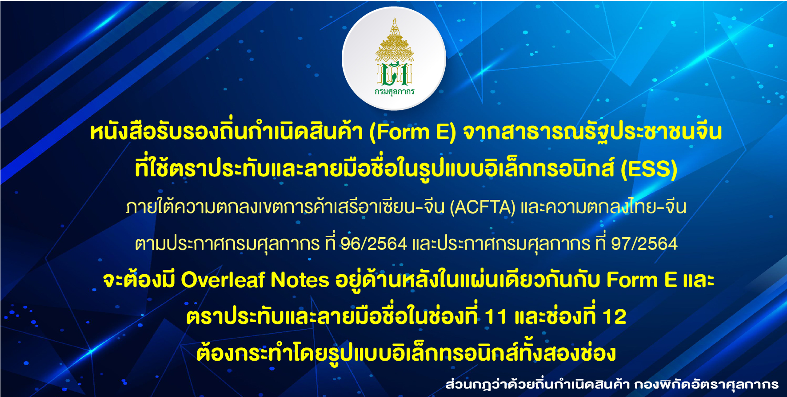

## หนังสือรับรองถิ่นกำเนิดสินค้า (Form E) จากสาธารณรัฐประชาชนจีนหนังสือรับรองถิ่นกำเนิดสินค้า (Form E) จากสาธารณรัฐประชาชนจีน ที่ใช้ตราประทับและลายมือชื่อในรูปแบบอิเล็กทรอนิกส์ (ESS)

 

**สอบถามข้อมูลเพิ่มเติมได้ที่ :** ฝ่ายประชาสัมพันธ์ สสก. สบก. กรมศุลกากร    
**หมายเลขโทรศัพท์ :** 0-2667-7600  
**อีเมล์ :** prcustoms@gmail.com  
**วันที่ปรับปรุงล่าสุด :** 31 กรกฎาคม 2564 

> ที่มา : [กรมศุลกากร](https://www.customs.go.th/cont_strc_slide_image.php?current_id=14232932404e505f4c464a4e464a4e)
