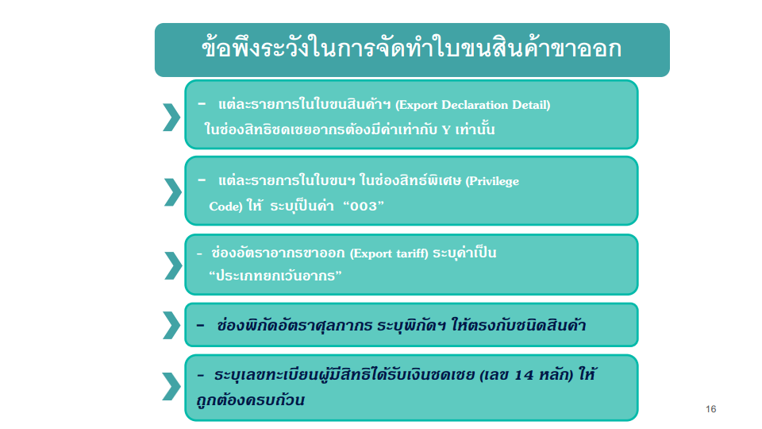
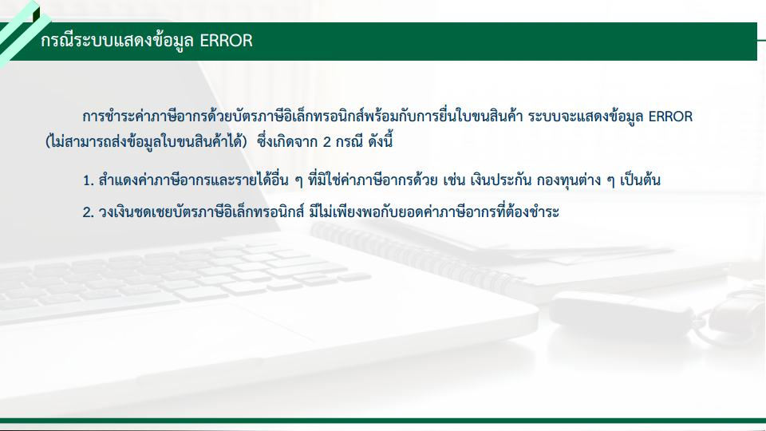
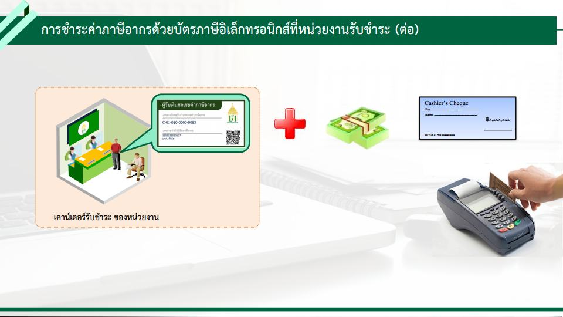
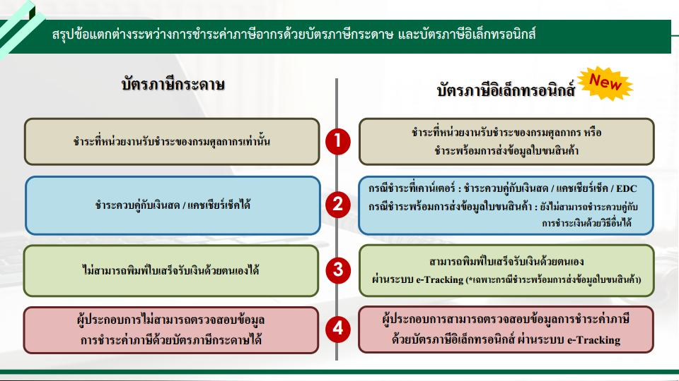

เนื่องจากกรมศุลกากรจะมีการเปลี่ยนแปลงสำหรับการใช้สิทธิ์ชดเชยค่าภาษีอากร (Compensation) จากเดิมที่เป็นบัตรบัตรภาษีในรูปแบบกระดาษ เป็นบัตรอิเล็กทรอนิกส์ ซึ่งจะเริ่มใช้งานใน*วันที่ 21 ก.ย. 2564* (กำหนดการแน่นอนเนื่องจากเป็นกำหนด 90 วันตามกฎหมาย) และศุลกากรมีโครงการเพิ่มเติมคือ **โครงการพัฒนาระบบชำระค่าภาษีอากรด้วยบัตรภาษีอิเล็กทรอนิกส์ (Digital Tax Compensation : DTC)** โดยเป็นความร่วมมือ ระหว่าง กรมศุลกากร กรมสรรพากร และกรมสรรพสามิต เพื่อพัฒนาระบบชำระค่าภาษีอากรด้วยบัตรภาษีอิเล็กทรอนิกส์ ซึ่งผู้ประกอบการสามารถการชำระค่าภาษีอากรด้วยวงเงินชดเชยอิเล็กทรอนิกส์พร้อมกับใบขนสินค้าขาเข้าและใบขนสินค้าขาออก รวมทั้งสามารถชำระเงินค่าภาษีอากรด้วยบัตรภาษีอิเล็กทรอนิกส์ได้ด้วยตนเองตลอด 24 ชั่วโมง และไม่ต้องเดินทางมายังกรมศุลกากร โดยจะเริ่มใช้วันที่ 21 กันยายน 2564 เป็นต้นไป จึงจะขอสรุปเบื้องต้นเฉพาะในส่วนที่กระทบกับใบขนสินค้าขาเข้า-ขาออกของเราก่อน เพื่อใช้เป็นข้อมูลเบื้องต้นในการตอบคำถามกับผู้ใช้ต่อไป

## การลงทะเบียนผู้มีสิทธิได้รับเงินชดเชย

สำหรับ**ผู้ที่เคยใช้สิทธิย้อนหลัง 3 ปี** _(17 ส.ค. 61 – 16 ส.ค. 64)_ และผู้ใช้สิทธิที่ยังคงมี*บัตรภาษีแบบกระดาษที่ยังไม่ได้ใช้ ณ วันที่ 20 กันยายน 2564* กรมศุลกากร จะกำหนดเลขทะเบียนผู้มีสิทธิได้รับเงินชดเชยค่าภาษีอากร (14 หลัก) ให้โดยอัตโนมัติทุกราย โดยผู้ประกอบการไม่ต้องลงทะเบียนแต่อย่างใด และเปลี่ยนบัตรภาษี   จำนวนดังกล่าวทั้งหมดที่ยังไม่หมดอายุ เป็นบัตรภาษีอิเล็กทรอนิกส์ โดยมิต้องร้องขอ โดยจะเรียงลำดับบัตรภาษีอิเล็กทรอนิกส์ตามวันที่ออกบัตรภาษีเดิม (1 ชุดคำขอฯ ซึ่งอาจมีบัตรภาษี กระดาษหลายฉบับจะเปลี่ยนเป็นบัตรภาษีอิเล็กทรอนิกส์ฉบับเดียว) โดยบัตรภาษีอิเล็กทรอนิกส์ จะมีอายุเท่ากับบัตรภาษีเดิม

## การบันทึกข้อมูลในใบขนสินค้าขาออก

เพิ่มเติมการระบุ**เลขทะเบียนผู้มีสิทธิได้รับเงินชดเชย (เลข 14 หลัก)** ขึ้นต้นด้วยอักษร **C** ซึ่งเป็นเลขสิทธิประโยชน์ลักษณะเดียวกันกับสิทธิ์ Freezone, มาตรา29 ฯลฯ

## การบันทึกข้อมูลในใบขนสินค้าขาเข้า

ผู้ประกอบการสามารถใช้บัตรภาษีอิเล็กทรอนิกส์ชำระ  ค่าภาษีอากรได้ที่กรมศุลกากร กรมสรรพากร และ กรมสรรพสามิต  ในส่วนของการชำระค่าภาษีอากรที่กรมศุลกากร ผู้ประกอบการสามารถดำเนินการได้ 2 วิธี คือ 

### ชำระพร้อมกับการยื่นข้อมูลใบขนสินค้า


เพิ่ม Payment Method (วิธีการชำระค่าภาษีอากร) = **C  บัตรภาษีอิเล็กทรอนิกส์**


 

### การชำระค่าภาษีอากรด้วยบัตรภาษีอิเล็กทรอนิกส์ที่หน่วยงานรับชำระ

> ที่มา : [กรมศุลกากร](www.customs.go.th)
