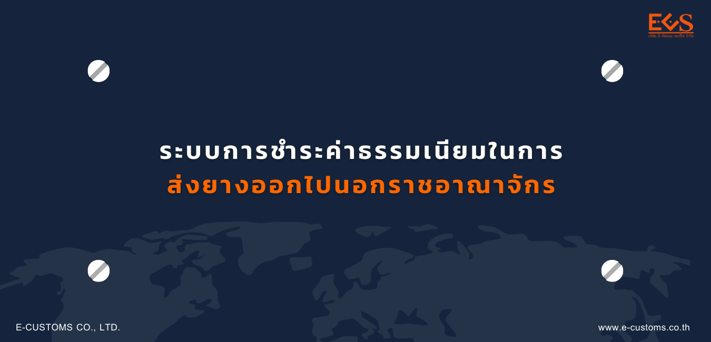

ตามที่การยางแห่งประเทศไทย (กยท.) ได้พัฒนาระบบรับชำระค่าธรรมเนียมทางอิเล็กทรอนิกส์ผ่านระบบ NSW (e-Cess) รองรับการแลกเปลี่ยนข้อมูลแบบ G2G และ B2G โดยระบบสามารถดำเนินการตั้งแต่ปี 2556 จวบจนปัจจุบัน และเนื่องจากนโยบายภาครัฐด้านการอำนวยความสะดวกในการทำธุรกิจ (Ease of Doing Business) จึงได้มีโครงการเชื่อมโยงข้อมูลในรูปแบบ Single Form ร่วมกันระหว่างกรมศุลกากร กรมวิชาการเกษตร และ กยท.  

ดังนั้น กยท. จึงได้ดำเนินการจัดทำโครงการเพื่อตอบสนองนโยบายภาครัฐจำนวน 2 โครงการ ดังนี้

1. โครงการพัฒนาระบบรับคำขอใบรับรองคุณภาพยางทางอิเล็กทรอนิกส์ผ่านระบบ National Single Window (NSW) (e-QC)
2. โครงการปรับปรุงระบบรับชำระค่าธรรมเนียมทางอิเล็กทรอนิกส์เพื่อรองรับการเชื่อมโยงข้อมูลร่วมกับระบบรับคำขอใบอนุญาตผ่านด่านศุลกากร และใบรับชำระค่าธรรมเนียมในการส่งยางออกไปนอกราชอาณาจักรแบบ Single Form ผ่านระบบ National Single Window (NSW) (e-SFR)

ปัจจุบัน กยท. ได้ดำเนินการโครงการปรับปรุงระบบรับชำระค่าธรรมเนียมทางอิเล็กทรอนิกส์ เพื่อรองรับการเชื่อมโยงข้อมูลร่วมกับ ระบบรับคำขอใบอนุญาตผ่านด่านศุลกากร และใบรับชำระค่าธรรมเนียมในการส่งยางออกไปนอกราชอาณาจักรแบบ Single Form ผ่านระบบ National Single Window (NSW) (RAOT e-SFR) เรียบร้อยแล้ว มีกำหนดการเปิดให้บริการแก่ผู้ประกอบการในวันที่ 1 มิถุนายน 2564 โดยกำหนดเปิดให้บริการคู่ขนานกับระบบเดิม (ระบบรับชำระค่าธรรมเนียมทางอิเล็กทรอนิกส์ ผ่านระบบ NSW (ระบบ e-Cess)) ระหว่างวันที่ 1 มิถุนายน 2564 ถึงวันที่ 31 กรกฎาคม 2564 และมีกำหนดการ*ยุติการให้บริการระบบเดิม (ระบบรับชำระค่าธรรมเนียมทางอิเล็กทรอนิกส์ ผ่านระบบ NSW (ระบบ e-Cess)) ในวันที่ 1 สิงหาคม 2564*

ทั้งนี้ ผู้ประกอบการสามารถดำเนินการได้ตามขั้นตอนต่อไปนี้

1. ปรับปรุงทะเบียน National Single Window (NSW) ภายในวันที่ 30 มิถุนายน 2564 โดยเพิ่มเอกสาร ดังนี้
   - คำขอหนังสือใบรับรองคุณภาพยางและใบรายงานผลการทดสอบ
   - คำขอใบผ่านด่านศุลกากรและใบชำระเงินค่าธรรมเนียมส่งออกยางพารา
   - คำขอยกเลิกใบรับรองคุณภาพยาง/คำขอยกเลิกใบชำระเงินค่าธรรมเนียมส่งออกยาง
2. ผู้ประกอบการ ติดต่อผู้ให้บริการซอฟต์แวร์ เพื่อปรับปรุงซอฟต์แวร์ให้รองรับการรับชำระค่าธรรมเนียมทางอิเล็กทรอนิกส์ เชื่อมโยงข้อมูลร่วมกับระบบรับคำขอใบอนุญาตผ่านด่านศุลกากร และใบรับชำระค่าธรรมเนียมการส่งยางออกไปนอกราชอาณาจักรแบบ Single Form ผ่านระบบ National Single Window (NSW) (e-SFR) และทำการทดสอบการรับส่งข้อมูลให้แล้วเสร็จภายในวันที่ 31 กรกฎาคม 2564

เมื่อได้รับการอนุมัติเอกสารในระบบ National Single Window (NSW) โดย กยท. แล้ว ผู้ประกอบการจึงสามารถส่งรายการผ่านระบบรับคำขอใบอนุญาตผ่านด่านศุลกากร และใบรับชำระค่าธรรมเนียมการส่งยางออกไปนอกราชอาณาจักรแบบ Single Form ผ่านระบบ National Single Window (NSW) (e-SFR) ได้

การรับชำระค่าธรรมเนียมทางอิเล็กทรอนิกส์ผ่านระบบ NSW (e-Cess) แบบเดิม มีผลบังคับใช้สิ้นสุด ณ วันที่ 1 สิงหาคม 2564 โดยเอกสารใบรับชำระค่าธรรมเนียมทางอิเล็กทรอนิกส์แบบเดิม (e-Cess) สามารถใช้งานเอกสารได้ตามอายุของเอกสาร (30 วันนับจากวันที่ออกใบรับค่าธรรมเนียม) และขอคืนเงินค่าธรรมเนียมได้ตามปกติ

### ผู้ให้บริการซอฟต์แวร์ที่พร้อมให้บริการระบบ e-SFR 
ตั้งแต่วันที่ 1 มิถุนายน 2564 เป็นต้นไป มีดังนี้

1. บริษัท อี-คัสตอม เซอร์วิส จำกัด

### ธนาคารที่พร้อมให้บริการระบบ e-SFR 
ตั้งแต่วันที่ 1 มิถุนายน 2564 เป็นต้นไป มีดังนี้

1. ธนาคารไทยพาณิชย์
2. ธนาคารกสิกรไทย
3. ธนาคารกรุงศรีอยุธยา
4. ธนาคารทหารไทยธนชาต (ธนาคารทหารไทย)

*สำหรับธนาคารกรุงเทพ และธนาคารกรุงไทย สามารถให้บริการระบบ e-SFR ได้ ในวันที่ 1 สิงหาคม 2564 เป็นต้นไป*

**หากมีข้อสงสัยประการใด สามารถติดต่อสอบถามรายละเอียดได้ที่**  

>- ecess@rubber.mail.go.th
>- saowanee.p@rubber.mail.go.th
>- นางสาวเสาวณีย์ พันธ์คูณ ผู้ประสานงาน โทร 086 353 5569  

 

> ที่มา : [การยางแห่งประเทศไทย](http://www.raot.co.th/ewt_news.php?nid=89751&filename=index)
