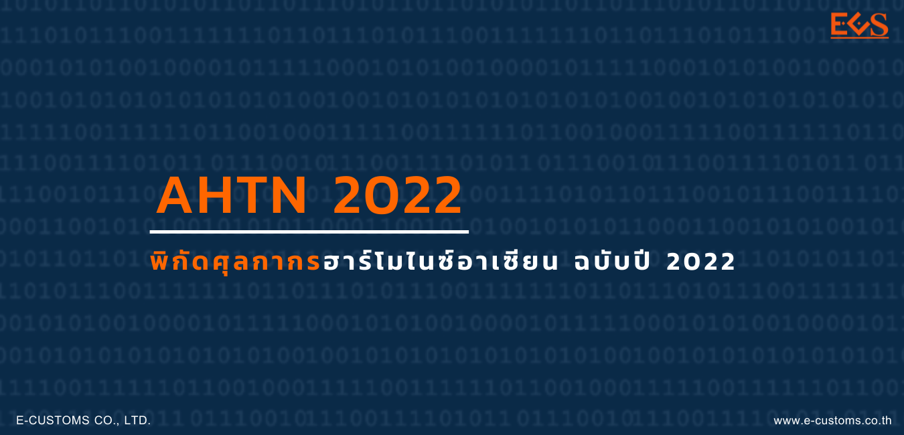
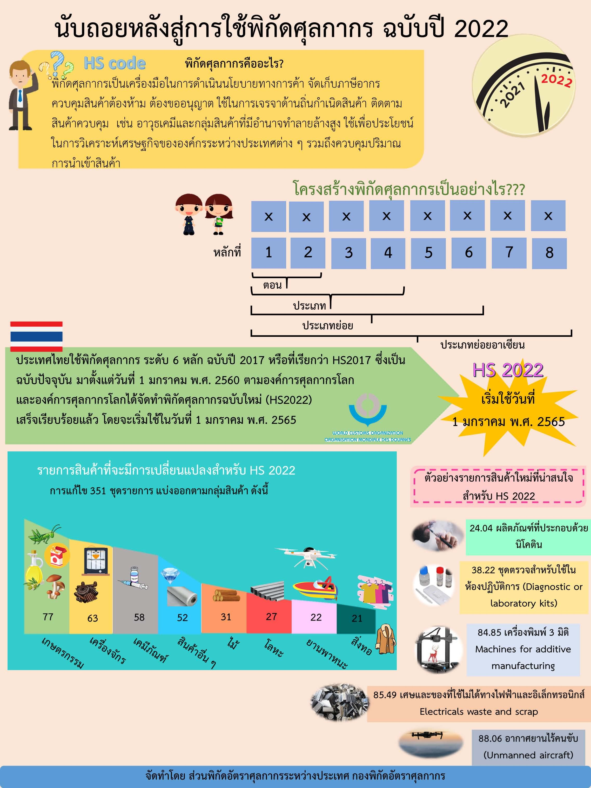
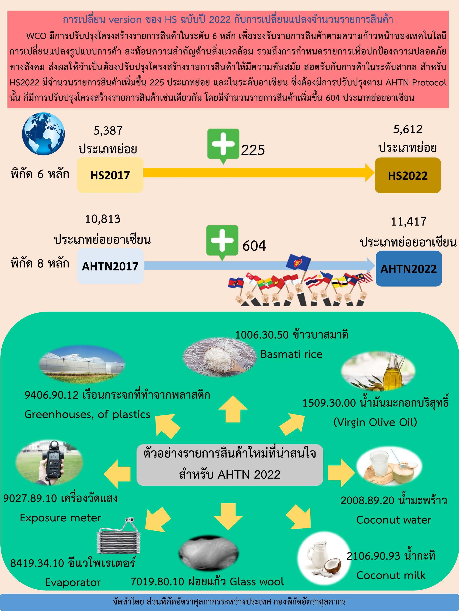

กรมศุลกากรแจ้งประชาสัมพันธ์ เรื่องการจะนำ**พิกัดศุลกากรระบบฮาโมไนซ์อาเซียน (AHTN) ฉบับปี 2022** มาใช้ *เริ่ม 1 มกราคม 2565* เป็นต้นไป จึงขอแจ้งให้ผู้ใช้งานได้รับทราบและเตรียมพร้อมสำหรับการเปลี่ยนแปลงที่กำลังจะเกิดขึ้นดังกล่าว โดยทาง ECS จะติดตามความเคลื่อนไหวในเรื่องนี้อย่างใกล้ชิด เมื่อมีข้อมูลเพิ่มเติมจะแจ้งให้ผู้ใช้งานได้ทราบข้อมูลต่อไป

  


 

 

<a class="badge badge-danger" href="./docs.pdf" target="_blank" id="download_files_new">Download</a>

 



ที่มา : [กรมศุลกากร](http://www.customs.go.th/cont_strc_simple_with_date.php?current_id=14232932404e505f4d464b4a464a4f)