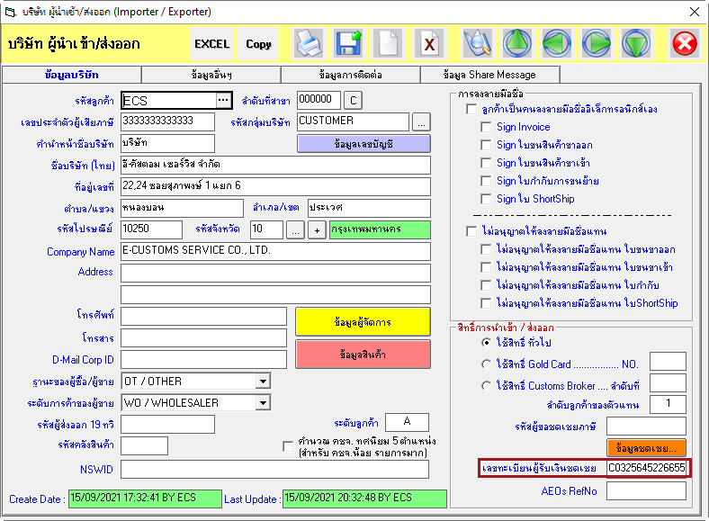

เนื่องจากใน*วันที่ 21 กันยายน 2564* ที่จะถึงนี้ เป็นวันครบกำหนด**เก้าสิบวัน**นับแต่วันที่ กฎกระทรวง เรื่อง **กำหนดแบบ ลักษณะ ราคา และรายละเอียดของบัตรภาษี**  พ.ศ. 2564 [[ดาวน์โหลด]](http://www.customs.go.th/data_files/7cb973afc2e996bc98a9a11cb79c243e.pdf)  ประกาศในราชกิจจานุเบกษา จึงมีผลทำให้กรมศุลกากรต้องจัดทำบัตรภาษีให้เป็นบัตรภาษีอิเล็กทรอนิกส์ และเปลี่ยนบัตรภาษีในรูปแบบกระดาษที่ยังไม่ได้ใช้ ให้เป็นบัตรภาษีอิเล็กทรอนิกส์ ตามที่กฎกระทรวงกำหนดไว้  และการเปลี่ยนแปลงรูปแบบการจ่ายเงินชดเชยค่าภาษีอากรสินค้าส่งออก ที่ผลิตในราชอาณาจักร จากเดิมที่จ่ายเป็นบัตรภาษีในรูปแบบกระดาษ เปลี่ยนเป็น**บัตรภาษีอิเล็กทรอนิกส์** ตาม ประกาศกรมศุลกากรที่ 16/2564 เรื่อง **คู่มือการดำเนินธุรกรรมทางอิเล็กทรอนิกส์สำหรับการชดเชยค่าภาษีอากรด้วยบัตรภาษีอิเล็กทรอนิกส์** (Digital Tax Compensation) [[ดาวน์โหลด]](https://ecs-support.github.io/KM/customs/post/news/2021-08-20/docs/DigitalTaxCompensation.pdf)  

จึงทำให้เกิดการปรับปรุง เปลี่ยนแปลง เพิ่มเติม กระบวนการทางศุลกากรในหลาย ๆ ด้าน ทำให้มีคำถามจากผู้ใช้งานเป็นจำนวนมาก และมากขึ้นเรื่อย ๆ เมื่อใกล้ถึงวันที่จะเริ่มใช้งานระบบดังกล่าวในวันที่ 21 กันยายน 2564 นี้ ทางทีม Support จึงได้จัดทำคู่มือการบันทึกข้อมูลใบขนสินค้า เพื่อให้ผู้ใช้งานได้ทราบถึงการเปลี่ยนแปลงที่กระทบกับการบันทึกข้อมูล รวมทั้งกฎหมายที่เกี่ยวข้องกับเรื่องดังกล่าว เพื่อให้ได้ทราบถึงเหตุผลการเปลี่ยนแปลง ซึ่งมีรายละเอียดดังนี้

## Common Data (บริษัทผู้นำเข้า-ส่งออก)

- เพิ่มเติมในส่วนของ *เลขทะเบียนผู้รับเงินชดเชย* โดยใช้ทำการบันทึกในระบบในครั้งแรก เพื่ออ้างอิงการใช้สิทธิ์ชดเชยค่าภาษีอากร รวมทั้งการชำระเงินค่าภาษีอากรด้วยบัตรภาษีอิเล็กทรอนิกส์ ของผู้นำเข้า-ส่งออก ในการจัดทำใบขนสินค้า โปรแกรมจะตววจสอบการบันทึกข้อมูลในช่องดังกล่าวต้องขึ้นต้นด้วยอักษร **C** และมีความยาวทั้งหมด **14 ตัวอักษร** 

## ใบขนสินค้าขาออก


**เฉพาะใบขนสินค้าขาออก** ที่ใช้สิทธิ์*ชดเชยค่าภาษีอากร* เท่านั้น


ตามประกาศกรมศุลกากรที่ 16/.2564 เรื่อง คู่มือการดำเนินธุรกรรมทางอิเล็กทรอนิกส์สำหรับการชดเชยค่าภาษีอากรด้วยบัตรภาษีอิเล็กทรอนิกส์ (Digital Tax Compensation) [[ดาวน์โหลด]](https://ecs-support.github.io/KM/customs/post/news/2021-08-20/docs/DigitalTaxCompensation.pdf) กำหนดไว้ว่า "ผู้ประสงค์จะขอรับเงินชดเชยต้องมีชื่อเป็นผู้ส่งของออกตามใบขนสินค้าขาออก ต้องจัดทำข้อมูลใบขนสินค้าขาออกให้ตรงกับความเป็นจริง และเพียงพอแก่การขอ   ใช้สิทธิรับเงินชดเชย ดังนี้"

- Document Type ชนิดเอกสาร มีค่าเป็น *1 – ใบขนสินค้าขาออก*
- ผู้ประสงค์จะขอรับเงินชดเชยต้องเป็น*ผู้ส่งของออก* ตามใบขนสินค้าขาออก
- Compensation ใช้สิทธิ์ชดเชยอำกรหรือไม่ *มีค่าเท่ากับ Y (Y = Yes)*
- **Import Tax Incentives ID** ให้ระบุ*เลขทะเบียนผู้รับเงินชดเชยค่ำภำษีอำกร 14 หลัก*

เมื่อผุู้ใช้งานเลือกใช้สิทธิ์ชดเชย โปรแกรมจะทำการดึงข้อมูลเลขทะเบียนผู้รับเงินชดเชย จากบริษัทผู้ส่งออกมาแสดงที่ช่อง Import Tax Incentives ID ตามที่ศุลกากรกำหนดโดยอัตโนมัติ และทำการลบข้อมูลช่องดังกล่าว เมื่อผู้ใช้ยกเลิกการใช้สิทธิ์ชดเชย รวมทั้งเพิ่มการตรวจสอบข้อมูล ก่อนที่จะส่งข้อมูลใบขนสินค้าขาออกให้ศุลกากร โดยกำหนดว่า รายการใดที่เลือกใช้สิทธิ์ชดเชย  ต้องบันทึกข้อมูลในช่อง Import Tax Incentives ID ดังนี้

- ต้องมีการบันทึกข้อมูลในช่องดังกล่าว (ห้ามเป็นค่าว่าง)
- ข้อมูลต้องขึ้นต้นด้วยอักษร **C** เท่านั้น
- ข้อมูลต้องมีความยาวทั้งหมด 14 ตัวอักษร

----

## ใบขนสินค้าขาเข้า


เฉพาะใบขนสินค้าขาเข้า ที่ต้องการ**ชำระค่าภาษีอากรด้วยวงเงินชดเชยค่าภาษีอากร บัตรภาษีอิเล็กทรอนิกส์** *พร้อมกับการยื่นใบขนสินค้า* เท่านั้น


- เพิ่มเติมรูปแบบการชำระค่าภาษีอากรประเภท **C - การชำระค่าภาษีอากรด้วยวงเงินชดเชยค่าภาษีอากร บัตรภาษีอิเล็กทรอนิกส์**
- เมื่อเลือกการชำระ = C โปรแกรมจะทำการดึงข้อมูลเลขทะเบียนผู้รับเงินชดเชย จากบริษัทผู้นำเข้ามาแสดงที่ช่อง เลขที่บัญชีเดบิต ตามที่ศุลกากรกำหนดให้โดยอัตโนมัติ  
- การชำระค่าภาษีอากรประเภท C มีรูปแบบคล้ายกับการชำระแบบ H (e-Payment) ที่กำหนดว่ายอดที่จะชำระต้องเท่ากับยอดภาษีรวม (Total Tax) หมายถึง การชำระด้วยวิธีเหล่านี้ไม่สามารถใช้ร่วมกับรูปแบบการชำระอื่น ๆ ได้ ทำให้ต้องมีวงเงินคงเหลือ เท่ากับหรือมากกว่าค่าภาษีที่ต้องชำระรวม

**ข้อควรทราบ**

- การนำบัตรภาษีอิเล็กทรอนิกส์ไปชำระที่ศุลกากร สามารถกำหนดรูปแบบการชำระได้หลากหลาย รวมทั้งแยกการชำระแต่ละประเภทภาษีได้เหมือนเดิม เหมือนรูปแบบกระดาษไม่มีการเปลี่ยนแปลง
- 

> ที่มา : [กรมศุลกากร](https://drive.google.com/file/d/1EjQltknTBiDqcTuK3dxUrwCiVSlH-R8E/view)