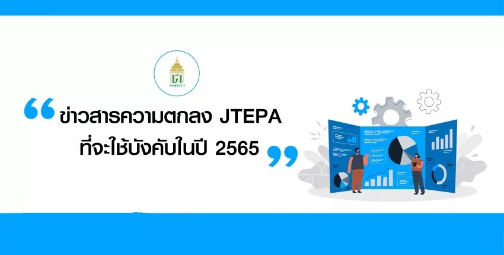
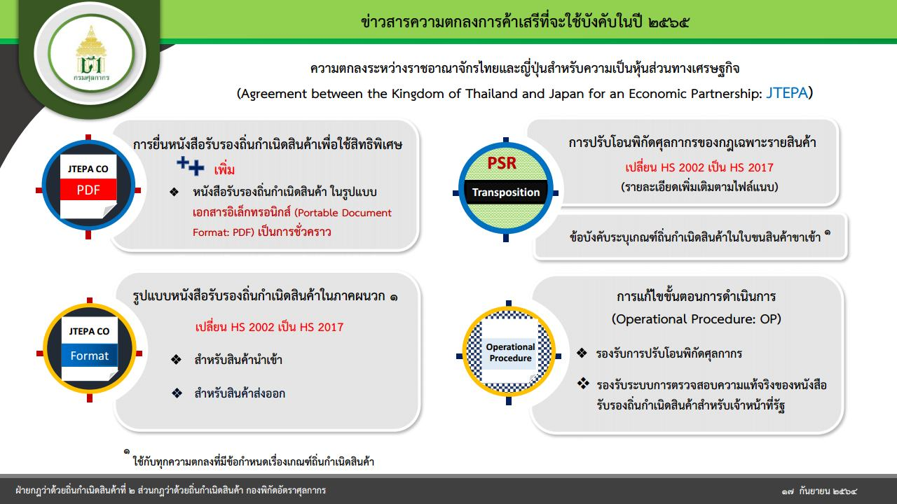


  


## **ความตกลงระหว่างราชอาณาจักรไทยและญี่ปุ่นสำหรับความเป็นหุ้นส่วนทางเศรษฐกิจ  (JTEPA) ที่จะใช้บังคับในปี 2565**


 





 

 

<a class="badge badge-danger" href="./docs.pdf" target="_blank" id="download_files_new">Download</a>

 



> ที่มา : [กรมศุลกากร](http://www.customs.go.th/data_files/ae5e9a9091097bce7f9e2ac0ac01fa01.pdf)
