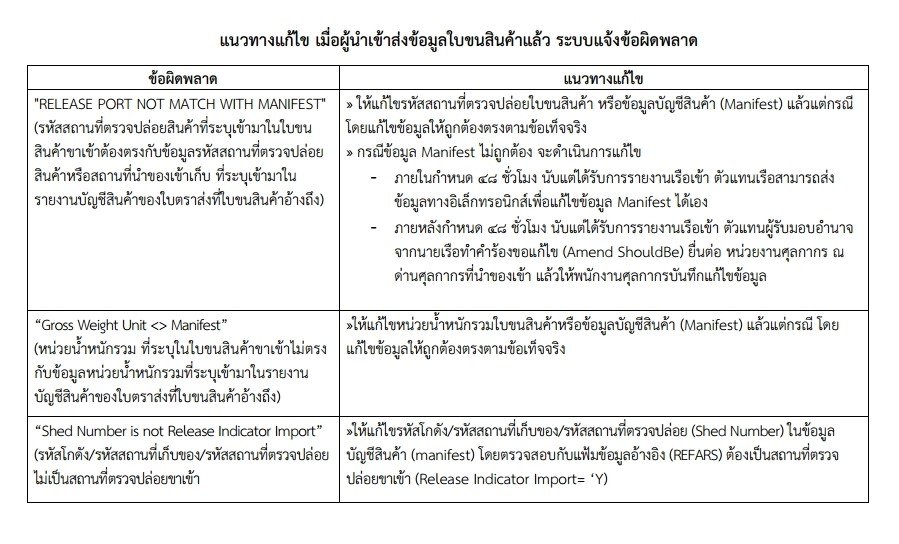

---
title:  การตรวจสอบข้อมูลในระบบคอมพิวเตอร์ศุลกากรเพิ่มเติม
subtitle:  เพื่อเป็นการเพิ่มประสิทธิภาพให้ระบบคอมพิวเตอร์ของศุลกากรมีความสมบูรณ์ และเป็นประโยชน์ต่อผู้นำเข้าและพนักงานศุลกากรมากขึ้น ศุลกากรจึงแจ้งการตรวจสอบข้อมูลในระบบเพิ่มเติม   
summary: เพื่อเป็นการเพิ่มประสิทธิภาพให้ระบบคอมพิวเตอร์ของศุลกากรมีความสมบูรณ์ และเป็นประโยชน์ต่อผู้นำเข้าและพนักงานศุลกากรมากขึ้น ศุลกากรจึงแจ้งการตรวจสอบข้อมูลในระบบเพิ่มเติม  
authors: 
  - admin
tags: ["สถานที่ตรวจปล่อย", "Shed Number","Gross Weight Unit","Release port"]
categories: ["news"]
date: "2021-11-02"
publishDate: "2021-11-02"
lastMod: "2021-11-02"
featured: false
draft: false

image:
  placement:
  caption:
  focal_point: ""
  preview_only: true
---  

เพื่อเป็นการเพิ่มประสิทธิภาพให้ระบบคอมพิวเตอร์ของศุลกากรมีความสมบูรณ์ และเป็นประโยชน์ต่อผู้นำเข้าและพนักงานศุลกากรมากขึ้น ศุลกากรจึงแจ้งการตรวจสอบข้อมูลในระบบเพิ่มเติม โดยมีกำหนดเวลาเริ่มต้นและรายละเอียดในการตรวจสอบข้อมูลดังนี้

1. ตั้งแต่*วันที่ 8 พฤศจิกายน 2564* เป็นต้นไป โปรแกรมรับข้อมูลรายงานบัญชีสินค้า (Manifest) ในส่วนประเภทของขบวนการนำเข้า (Processing Indicator=23) สำหรับเอกสารรายงานบัญชีสินค้าทางเรือ (MMAN) เอกสารรายงานบัญชีสินค้าทางอากาศยาน (ABIL) เอกสารรายงานบัญชีสินค้าทางรถยนต์ (CMAN) โดยตรวจสอบข้อมูล รหัสโกดัง/รหัสสถานที่เก็บของ/รหัสสถานที่ตรวจปล่อย (Shed Number) กับแฟ้มข้อมูลอ้างอิง (REFARS) ให้*ตรวจสอบการเป็นสถานที่ตรวจปล่อยขาเข้า (Release Indicator Import= Y)*  [**[ตรวจสอบข้อมูลสถานที่ตรวจปล่อย]**](https://ecs-support.github.io/KM/reference/area_code.html) หากพบว่ามีการส่งข้อมูลรหัสสถานที่ที่ไม่เป็นสถานที่ตรวจปล่อยขาเข้า เข้ามาให้แสดงข้อความผิดพลาด *“Shed Number is not Release Indicator Import”*

2. ตั้งแต่*วันที่ 1 ธันวาคม 2564* เป็นต้นไป ระบบ e-Import จะตรวจสอบข้อมูล *หน่วยน้ำหนักรวม (Gross Weight Unit)* ที่ระบุในใบขนสินค้าขาเข้าต้องตรงกับหน่วยน้ำหนักรวม (Gross Weight Unit) ของข้อมูลบัญชีสินค้า (Manifest) หากไม่ถูกต้องตรงกัน ระบบคอมพิวเตอร์ศุลกากรจะไม่ออกเลขที่ใบขนสินค้าให้และแจ้งข้อผิดพลาด (Response message error) เป็น *“Gross Weight Unit <> Manifest”* กลับไปให้ผู้นำของเข้าและตรวจสอบรหัสสถานที่ตรวจปล่อย ในระบบ e-Import ในการส่งข้อมูลใบขนสินค้ากับข้อมูลบัญชีสินค้า (Manifest) สำหรับใบขนสินค้านำเข้าจากต่างประเทศ (Type 0) ใบขนสินค้าขาเข้ารับของไปก่อน (Type 3) และใบขนสินค้าขาเข้าเร่งด่วน (Type X) ที่ขนส่งโดยสารทาง เรือ รถไฟ บก อากาศยาน ไปรษณีย์ และผู้โดยสารนำพา โดยตรวจสอบข้อมูล *รหัสสถานที่ตรวจปล่อย (Release Port)* ที่ระบุในใบขนสินค้าขาเข้า ต้องตรงกับข้อมูลรหัสโกดังหรือสถานที่เก็บของ(Shed Number /Release port) ที่ระบุในบัญชีสินค้า (Manifest) ที่ใบขนสินค้าอ้างถึงดังกล่าว หากไม่ถูกต้องตรงกัน ระบบคอมพิวเตอร์ศุลกากรจะไม่ออกเลขที่ใบขนสินค้าให้และแจ้งข้อผิดพลาด (Response message error) เป็น *“RELEASE PORT NOT MATCH WITH MANIFEST”* กลับไปให้ผู้นำของเข้า ทั้งนี้ท่านสามารถพิจารณาแก้ไขข้อผิดพลาดดังกล่าวได้ ตามภาพ

 

> ที่มา: กรมศุลกากร