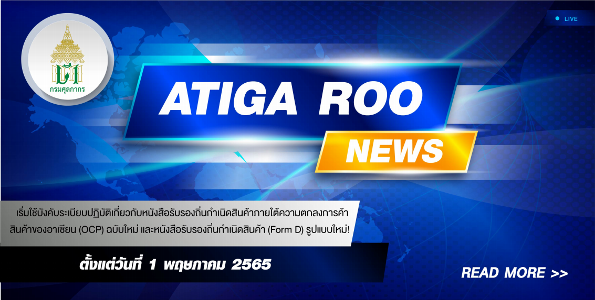
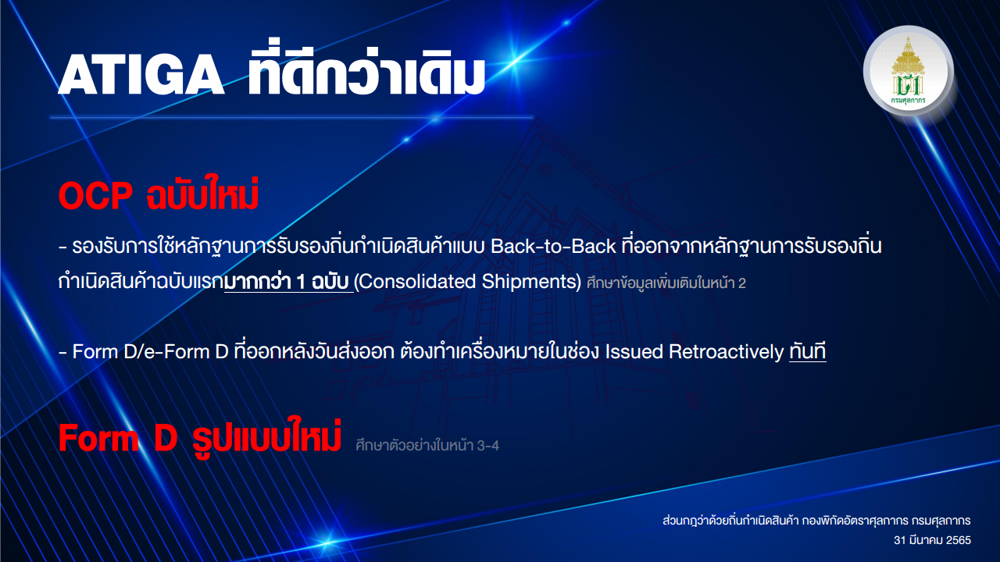

---
title:  หนังสือรับรองถิ่นกำเนิดสินค้าภายใต้ความตกลงการค้าสินค้าของอาเซียน (OCP) ฉบับใหม่ 
subtitle:  กรมศุลกากรจะเริ่มใช้บังคับระเบียบปฏิบัติเกี่ยวกับหนังสือรับรองถิ่นกำเนิดสินค้าภายใต้ความตกลงการค้าสินค้าของอาเซียน (OCP) ฉบับใหม่    
summary: กรมศุลกากรจะเริ่มใช้บังคับระเบียบปฏิบัติเกี่ยวกับหนังสือรับรองถิ่นกำเนิดสินค้าภายใต้ความตกลงการค้าสินค้าของอาเซียน (OCP) ฉบับใหม่  และหนังสือรับรองถิ่นกำเนิดสินค้า (Form D)
authors: 
  - admin
tags: ["ATIGA", "OCP"]
categories: ["news"]
date: "2022-04-07"
publishDate: "2022-04-07"
lastMod: "2022-04-07"
featured: false
draft: false

image:
  placement:
  caption:
  focal_point: ""
  preview_only: true
---  

กรมศุลกากรจะเริ่มใช้บังคับระเบียบปฏิบัติเกี่ยวกับหนังสือรับรองถิ่นกำเนิดสินค้าภายใต้ความตกลงการค้าสินค้าของอาเซียน (OCP) ฉบับใหม่  และหนังสือรับรองถิ่นกำเนิดสินค้า (Form D) (รายละเอียดตามเอกสารแนบ) *ตั้งแต่วันที่ 1 พฤษภาคม 2565 เป็นต้นไป*

- รองรับการใช้หลักฐานการรับรองถิ่นกำเนิดสินค้าแบบ Back-to-Back ที่ออกจากหลักฐานการรับรองถิ่นกำเนิดสินค้าฉบับแรกมากว่า 1 ฉบับ (Consolidated Shipments)
- Form D หรือ e-Form D ที่ออกหลังวันส่งออก ต้องทำเครื่องหมายในช่อง Issued Retroactively ทันที

 

> สอบถามข้อมูลเพิ่มเติมได้ที่ : 

ส่วนกฎว่าด้วยถิ่นกำเนิดสินค้า (สกก.) กองพิกัดอัตราศุลกากร (กพก.)
หมายเลขโทรศัพท์ : 0-2667-7014 หรือ 0-2667-6459
อีเมล์ : 80150000@customs.go.th

> ที่มา: [กรมศุลกากร](https://www.customs.go.th/cont_strc_simple_with_date.php?current_id=142329324147505f46464b4a464b4b)