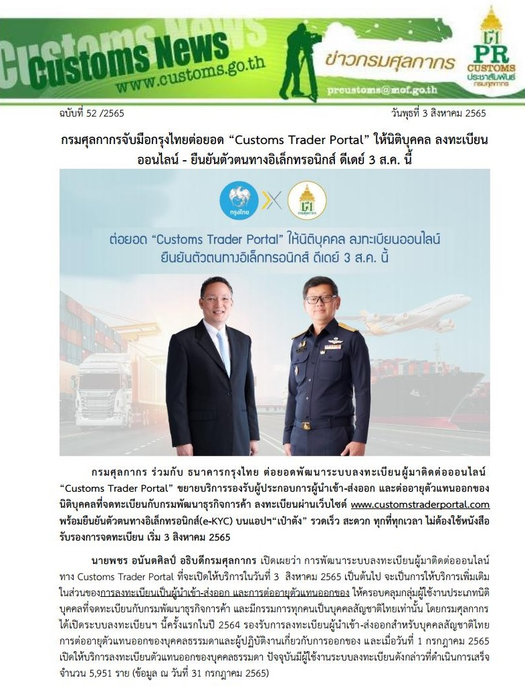
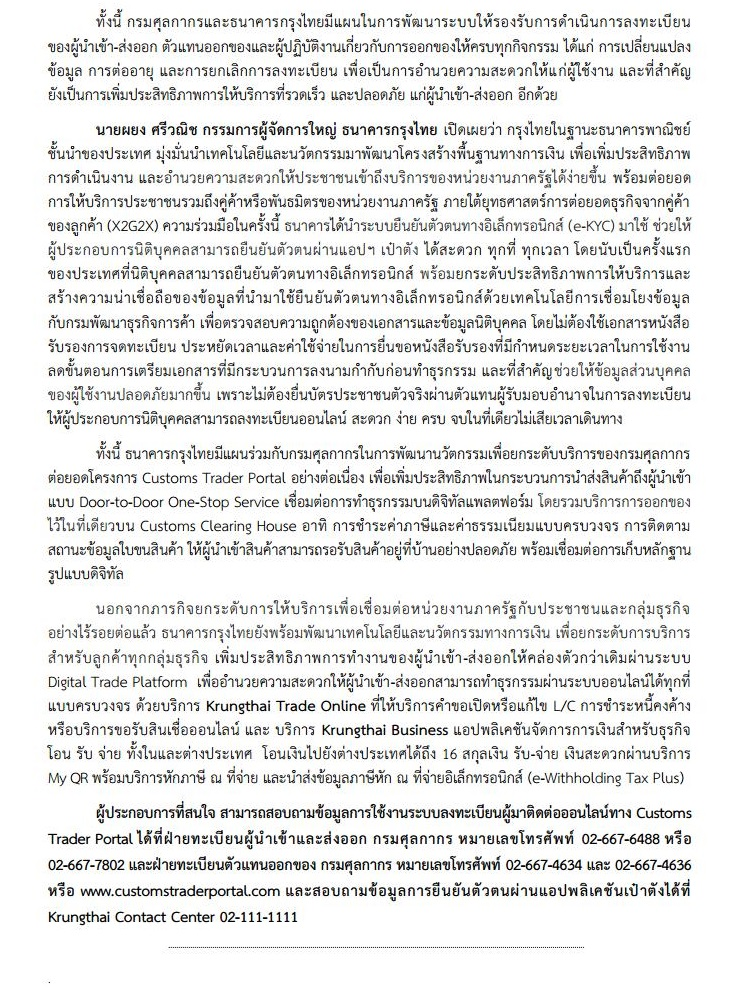

---
title:  กรมศุลกากรจับมือกรุงไทยต่อยอด "Customs Trader Portal"  ให้นิติบุคคลลงทะเบียนออนไลน์
subtitle:  ผู้ปฏิบัติงานเกี่ยวกับการออกของที่ไม่มีสังกัด ขอให้เร่งดำเนินการปรับปรุงคุณสมบัติให้ครบถ้วนถูกต้อง ภายในวันที่ 29 สิงหาคม 2565 
summary: ศุลกากร ร่วมกับ ธนาคารกรุงไทย  ต่อยอดพัฒนาระบบลงทะเบียนผู้มาติดต่อออนไลน์ **Customs Trader Portal**  ขยายบริการรองรับผู้ประกอบการผู้นำเข้า-ส่งออก และต่ออายุตัวแทนออกของ นิติบุคคลที่จดทะเบียนกับกรมพัฒนาธุรกิจการค้า
authors: 
  - admin
tags: ["Customs Trader Portal"]
categories: ["News"]
date: "2022-08-04"
publishDate: "2022-08-04"
lastMod: "2022-08-04"
featured: false
draft: false

image:
  placement:
  caption:
  focal_point: ""
  preview_only: true
---  

ศุลกากร ร่วมกับ ธนาคารกรุงไทย  ต่อยอดพัฒนาระบบลงทะเบียนผู้มาติดต่อออนไลน์ **Customs Trader Portal**  ขยายบริการรองรับผู้ประกอบการผู้นำเข้า-ส่งออก และต่ออายุตัวแทนออกของ นิติบุคคลที่จดทะเบียนกับกรมพัฒนาธุรกิจการค้า ลงทะเบียนผ่านเว็บไซต์  www.customstraderportal.com  พร้อมยืนยันตัวตนทางอิเล็กทรอนิกส์ (e-KYC) บนแอปฯ**เป๋าตัง**  รวดเร็ว สะดวก ทุกที่ทุกเวลา ไม่ต้องใช้หนังสือรับรองการจดทะเบียน เริ่ม  3 สิงหาคม  2565

 

 

> ที่มา : [กรมศุลกากร](https://www.customs.go.th/cont_strc_simple_with_date.php?current_id=142329324148505f46464b48464b47)