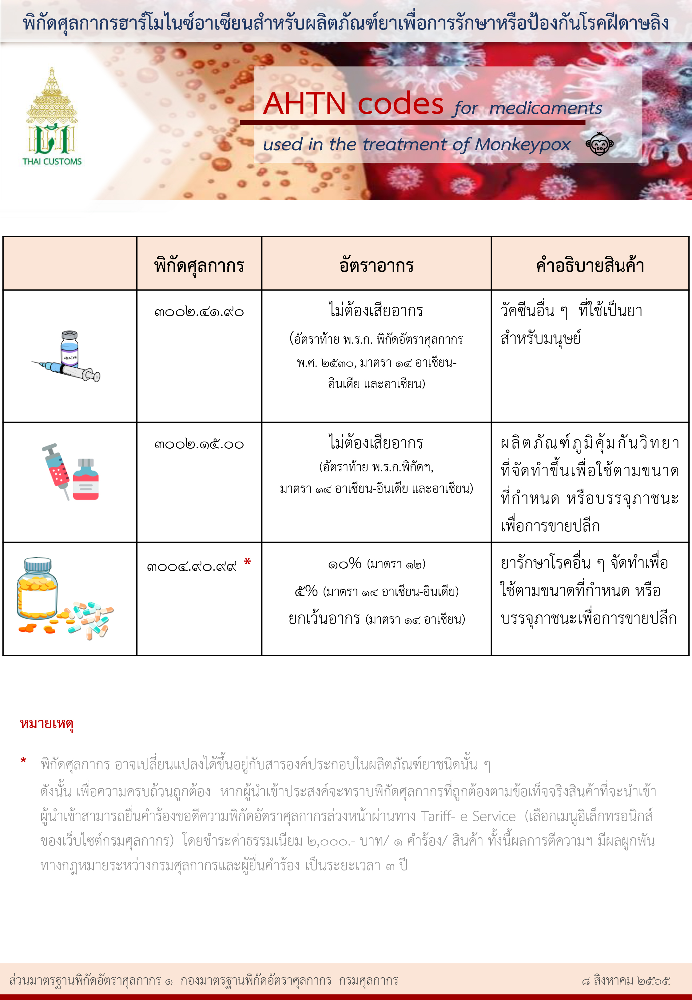

---
title:  พิกัดศุลกากรฮาร์โมไนซ์อาเซียนสำหรับผลิตภัณฑ์ยา เพื่อการรักษาหรือป้องกันโรคฝีดาษลิง
subtitle:  พิกัดศุลกากรฮาร์โมไนซ์อาเซียนสำหรับผลิตภัณฑ์ยา เพื่อการรักษาหรือป้องกันโรคฝีดาษลิง  
summary: พิกัดศุลกากรฮาร์โมไนซ์อาเซียนสำหรับผลิตภัณฑ์ยา เพื่อการรักษาหรือป้องกันโรคฝีดาษลิง
authors: 
  - admin
tags: ["โรคฝีดาษลิง"]
categories: ["News"]
date: "2022-08-11"
publishDate: "2022-08-11"
lastMod: "2022-08-11"
featured: false
draft: false

image:
  placement:
  caption:
  focal_point: ""
  preview_only: true
---  

 

> ที่มา : [ส่วนมาตรฐานพิกัดอัตราศุลกากร 1 กองมาตรฐานพิกัดอัตราศุลกากร](https://customs.go.th/cont_strc_slide_image.php?current_id=142329324148505f47464b46464b4b)