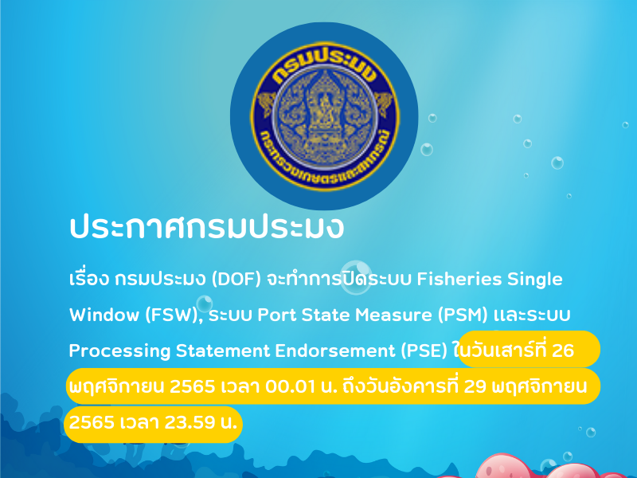

---
title:  กรมประมงขอเปิดใช้งานรหัสยกเว้น EXEMPT100 ตั้งแต่วันที่ 26 - 29 พฤศจิกายน 2565
subtitle:  กรมประมงขอเปิดใช้งานรหัสยกเว้น EXEMPT100 ตั้งแต่วันที่ 26 - 29 พฤศจิกายน 2565
summary: กรมประมงขอเปิดใช้งานรหัสยกเว้น EXEMPT100 ตั้งแต่วันที่ 26 - 29 พฤศจิกายน 2565
authors: 
  - admin
tags: ["กรมประมง"]
categories: ["News"]
date: "2022-11-13"
publishDate: "2022-11-13"
lastMod: "2022-11-13"
featured: false
draft: false

image:
  placement:
  caption:
  focal_point: ""
  preview_only: true
---  

 

 ด้วยกรมประมง (DOF) จะทำการปิดระบบสนับสนุนใบอนุญาตและใบรับรองผ่านอินเตอร์เน็ตของกรมประมง (FSW) ระบบการตรวจสอบตามมาตรการรัฐเจ้าของท่า (PSM) และระบบการออกหนังสือรับรองการแปรรูปสัตว์น้ำ (PSE) บนระบบงานจริง (Production) ใน*วันเสาร์ที่ 26 พฤศจิกายน 2565 เวลา 00.01 น. ถึงวันอังคารที่ 29 พฤศจิกายน 2565 เวลา 23.59 น.* เพื่อติดตั้งระบบงานแอปพลิเคชันซอฟต์แวร์โครงการพัฒนาระบบเชื่อมโยงทางอิเล็กทรอนิกส์สินค้าประมง ผ่านระบบ National Single Window ซึ่งการดำเนินการดังกล่าว ส่งผลให้ระบบไม่สามารถรับ - ส่งข้อมูลใบอนุญาตหรือใบรับรองอิเล็กทรอนิกส์ไปยังระบบของกรมศุลกากรได้ รวมถึงกรณีใบอนุญาตใบรับรองเร่งด่วนที่ดำเนินการออกในรูปแบบกระดาษ (Manual) ณ หน่วยงานที่รับผิดชอบด้วย 

อย่างไรก็ตามเพื่อเป็นการลดผลกระทบต่อผู้ประกอบการที่ประสงค์จะนำเข้า - ส่งออก สินค้าประมงในช่วงวันและเวลาดังกล่าว สามารถใช้รหัสยกเว้น *EXEMPT100* โดยให้*ระบุ Issue Date ตามวันที่ออกใบอนุญาต* ในการจัดทำใบขนสินค้า





ดาวน์โหลดประกาศ



**สอบถามข้อมูลเพิ่มเติมได้ที่ :** NSW Help Desk and Call Center   
โทร : 0-2109-3000 e-mail : callcenter@thainsw.net


> ที่มา : [ThaiNSW](https://www.thainsw.net/INSW/Ent/DisplayDocumentDetailServlet)

