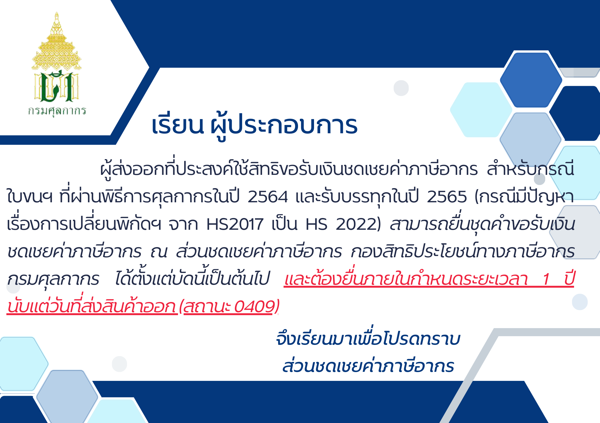

---
title:  การยื่นขอรับเงินชดเชยค่าภาษีอากร กรณีใบขนฯ มีปัญหาเปลี่ยนผ่านพิกัดฮาร์โมไนซ์
subtitle:  กรณีมีปัญหาเรื่องการเปลี่ยนพิกัดศุลกากร จาก HS2017 เป็น HS2022 
summary: การยื่นขอรับเงินชดเชยค่าภาษีอากร กรณีใบขนฯ มีปัญหาเปลี่ยนผ่านพิกัดฮาร์โมไนซ์ จาก HS2017 เป็น HS2022 
authors: 
  - admin
tags: ["ชดเชยค่าภาษีอากร"]
categories: ["news"]
date: "2022-11-14"
publishDate: "2022-11-14"
lastMod: "2022-11-14"
featured: false
draft: false

image:
  placement:
  caption:
  focal_point: ""
  preview_only: true
---  

 

 กองสิทธิประโยชน์ทางภาษีอากร กรมศุลกากร ขอเรียนประชาสัมพันธ์เกี่ยวกับ การขอรับเงินชดเชยค่าภาษีอากร ของผู้ส่งออกที่มีความประสงค์ใช้สิทธิ สำหรับกรณีใบขนสินค้าที่ผ่านพิธีการศุลกากรในปี 2564 และรับบรรทุกในปี 2565 (กรณีมีปัญหาเรื่องการเปลี่ยนพิกัดศุลกากร จาก HS2017 เป็น HS2022) สามารถยื่นชุดคำขอรับเงินชดเชยค่าภาษีอากร ณ ส่วนชดเชยค่าภาษีอากร กองสิทธิประโยชน์ทางภาษีอากร กรมศุลกากร ได้ตั้งแต่บัดนี้เป็นต้นไป และต้องยื่นภายในกำหนดระยะเวลา 1 ปีนับแต่วันที่ส่งสินค้าออก (สถานะ 0409) 

**สอบถามข้อมูลเพิ่มเติมได้ที่ :** กองสิทธิประโยชน์ทางภาษีอากร (กสอ.) โทรศัพท์ : 0-2667-6010 อีเมล์ : 82000100@customs.go.th

> ที่มา : [กรมศุลกากร](https://www.customs.go.th/cont_strc_slide_image.php?current_id=142329324149505e4f464b4a464b46)

