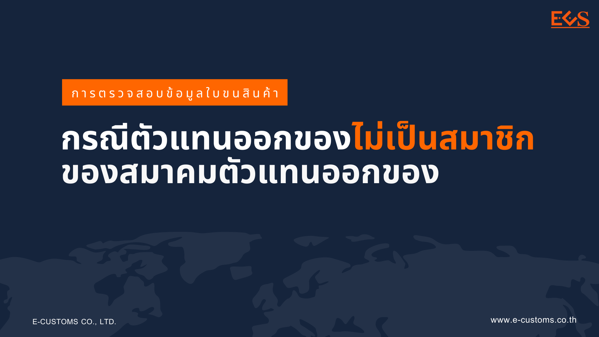
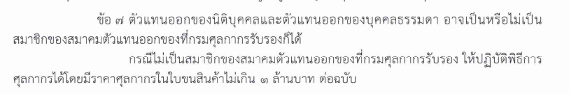

---
title:  ตัวแทนออกของไม่เป็นสมาชิกของสมาคมตัวแทนออกของที่กรมศุลกากรรับรอง
subtitle:  การตรวจสอบข้อมูลใบขนสินค้า กรณีตัวแทนออกของไม่เป็นสมาชิกของสมาคมตัวแทนออกของที่กรมศุลกากรรับรอง  
summary: การตรวจสอบข้อมูลใบขนสินค้า กรณีตัวแทนออกของไม่เป็นสมาชิกของสมาคมตัวแทนออกของที่กรมศุลกากรรับรอง
authors: 
  - admin
tags: ["ตัวแทนออกของ"]
categories: ["news"]
date: "2022-12-16"
publishDate: "2022-12-16"
lastMod: "2022-12-16"
featured: false
draft: false

image:
  placement:
  caption:
  focal_point: ""
  preview_only: true
---  



ส่วนพัฒนาระบบนำเข้า ศูนย์เทคโนโลยีสารสนเทศและการสื่อสาร กรมศุลกากร ได้แจ้งประชาสัมพันธ์เกี่ยวกับ การปรับปรุงการตรวจสอบข้อมูลใบขนสินค้าขาเข้าและใบขนสินค้าขาออก ให้สอดคล้องกับประกาศกรมศุลกากรที่ **96/2565** เรื่อง **ระเบียบปฏิบัติเกี่ยวกับตัวแทนออกของและผู้ปฏิบัติงานเกี่ยวกับการออกของ** ในส่วนที่ 1 บททั่วไป ข้อ 7 ความว่า *“ตัวแทนออกของนิติบุคคลและตัวแทนออกของบุคคลธรรมดา อาจเป็นหรือไม่เป็นสมาชิกสมาคมตัวแทนออกของที่กรมศุลกากรรับรองก็ได้ กรณีไม่เป็นสมาชิกของสมาคมตัวแทนออกของที่กรมศุลกากรรับรอง ให้ปฏิบัติพิธีการศุลกากรได้โดยมีราคาศุลกากรในใบขนสินค้าไม่เกิน 1 ล้านบาท ต่อฉบับ”*

ทั้งนี้ระบบคอมพิวเตอร์ของศุลกากรจะเริ่มตรวจสอบกรณีดังกล่าว และหากพบความไม่ถูกต้องจะมีการแจ้งกลับข้อผิดพลาด *"ตัวแทนออกของไม่เป็นสมาชิกของสมาคมตัวแทนออกของที่กรมศุลกากรรับรอง ให้ปฏิบัติพิธีการศุลกากรได้โดยมีราคาศุลกากรในใบขนสินค้าไม่เกิน 1 ล้านบาท ต่อฉบับ"* ตั้งแต่*วันที่ 16 มกราคม 2566 เป็นต้นไป* (กำหนดการเดิมคือ วันที่ 15 ธันวาคม 2565)






 

 

<a class="badge badge-danger" href="./docs.pdf" target="_blank" id="download_files_new">Download</a>

 



## เอกสารที่เกี่ยวข้อง

- [รายชื่อตัวแทนออกของ (นิติบุคคล) ที่ได้รับอนุญาตจากกรมศุลกากร ประจำเดือนกันยายน 2565](./broker_01.pdf)
- [รายชื่อตัวแทนออกของ (บุคคลธรรมดา) ที่ได้รับอนุญาตจากกรมศุลกากร ประจำเดือนกันยายน 2565](./broker_02.pdf)
- [รายชื่อผู้ปฏิบัติงานเกี่ยวกับการออกของ (ชิปปิ้ง) ที่ได้รับอนุญาตจากกรมศุลกากร ประจำเดือนกันยายน 2565](./shipping.pdf)

**สอบถามข้อมูลเพิ่มเติมได้ที่ :** กองมาตรฐานพิธีการและราคาศุลกากร (กมพ.)  
กรมศุลกากร เลขที่ 1 ถ.สุนทรโกษา คลองเตย กทม. 10110 อีเมล์ : 81000100@customs.go.th
- ฝ่ายทะเบียนผู้นำเข้าและส่งออก หมายเลขโทรศัพท์ : 0-2667-6488, 0-2667-7802, 0-2667-7983
- ฝ่ายทะเบียนตัวแทนออกของ หมายเลขโทรศัพท์ : 0-2667-7000 ต่อ 20-4634, 20-4636

> ที่มา : กรมศุลกากร