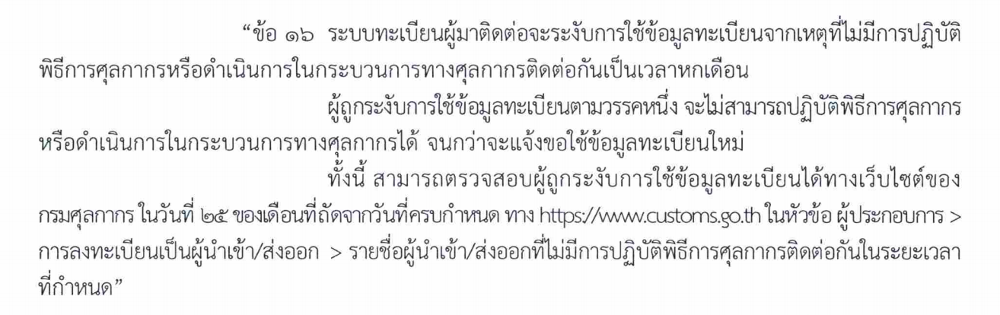

รายชื่อผู้นำเข้า/ส่งออกที่ไม่มีการปฏิบัติพิธีการศุลกากรติดต่อกันเป็นเวลา 6 เดือน ซึ่งกรมศุลกากรจะระงับการใช้ข้อมูล ในระบบทะเบียนผู้มาติดต่อ ณ วันที่ 25/03/2566 มีรายละเอียดดังนี้

-	รายชื่อผู้นำเข้า/ส่งออก *ประเภทบุคคลธรรมดา* ที่ไม่มีการปฏิบัติพิธีการศุลกากรติดต่อกันในระยะเวลาที่กำหนด
-	รายชื่อผู้นำเข้า/ส่งออก *ประเภทนิติบุคคล* ที่ไม่มีการปฏิบัติพิธีการศุลกากรติดต่อกันในระยะเวลาที่กำหนด 

ซึ่งเป็นไปตามประกาศกรมศุลกากรที่ 94/2565 เรื่อง การลงทะเบียนผู้ปฏิบัติพิธีการศุลกากรหรือดำเนินการในกระบวนการทางศุลกากร (ฉบับที่ 2) (ดาวน์โหลดประกาศ) ซึ่งได้มีการแก้ไขระยะเวลา ของผู้นำเข้า/ส่งออกประเภทนิติบุคคล ในการไม่มีการปฏิบัติพิธีการศุลกากรหรือดำเนินการในกระบวนการทางศุลกากรติดต่อกันเป็นระยะเวลา*หกเดือน* (เดิมกำหนดหนึ่งปี) จึงขอแจ้งเตือนและขอให้ผู้ใช้งานศึกษาทำความเข้าใจในการเปลี่ยนแปลงดังกล่าว เนื่องจากปัจจุบันพบว่ามี Error : COMPANY TAX NUMBER EXPIRED ตอบกลับจากศุลกากรจำนวนมาก ทำให้ผู้นำเข้า/ส่งออกที่ถูกระงับการใช้ข้อมูลทะเบียน จะไม่สามารถปฏิบัติพิธีการศุลกากรได้ จนกว่าจะแจ้งขอใช้ข้อมูลทะเบียนใหม่

## รายชื่อผู้นำเข้า/ส่งออก *ประเภทบุคคลธรรมดา* ที่ไม่มีการปฏิบัติพิธีการศุลกากรติดต่อกันในระยะเวลาที่กำหนด



บุคคลธรรมดา

## รายชื่อผู้นำเข้า/ส่งออก *ประเภทนิติบุคคล* ที่ไม่มีการปฏิบัติพิธีการศุลกากรติดต่อกันในระยะเวลาที่กำหนด



นิติบุคคล

> ที่มา : [กรมศุลกากร](https://www.customs.go.th/list_strc_download.php?ini_content=business_160426_01_160915_01_160915_04&ini_menu=menu_business_160421_01_160421_01&lang=th&root_left_menu=menu_business_160421_01_160421_01&left_menu=menu_business_160421_01_160421_01_160915_04)

