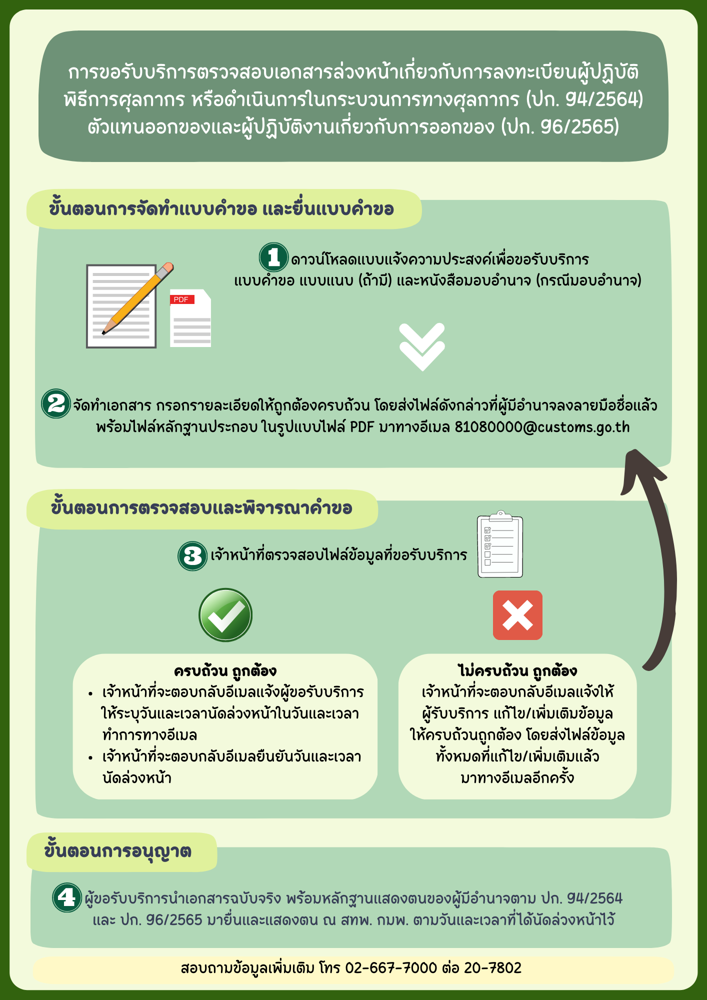

## ประกาศที่เกี่ยวข้อง :

-	ประกาศกรมศุลกากร ที่ 94/2564 เรื่อง การลงทะเบียนผู้ปฏิบัติพิธีการศุลกากรหรือดำเนินการในกระบวนการทางศุลกากร ([ดาวน์โหลดประกาศ](https://www.customs.go.th/cont_strc_download_with_docno_date.php?lang=th&top_menu=menu_homepage&current_id=14232932404e505f49464b48464b4c))
-	ประกาศกรมศุลกากร ที่ 96/2565 เรื่อง ระเบียบปฏิบัติเกี่ยวกับตัวแทนออกของและผู้ปฏิบัติงานเกี่ยวกับการออกของ ([ดาวน์โหลดประกาศ](https://www.customs.go.th/cont_strc_download_with_docno_date.php?lang=th&top_menu=menu_homepage&current_id=142329324147505f4d464b47464b4d))

> **วันที่ปรับปรุงล่าสุด :** 3 เมษายน 2566  
> **สอบถามข้อมูลเพิ่มเติมได้ที่ :** ส่วนทะเบียนและสิทธิพิเศษ (สทพ.) กองมาตรฐานพิธีการและราคาศุลกากร (กมพ.) โทรศัพท์ : 02-6677000 ต่อ 20-4634 และ 20-4636

> **ที่มา :** [กรมศุลกากร](https://www.customs.go.th/cont_strc_simple_with_date.php?current_id=14232932414a505f48464b4d464b48)

