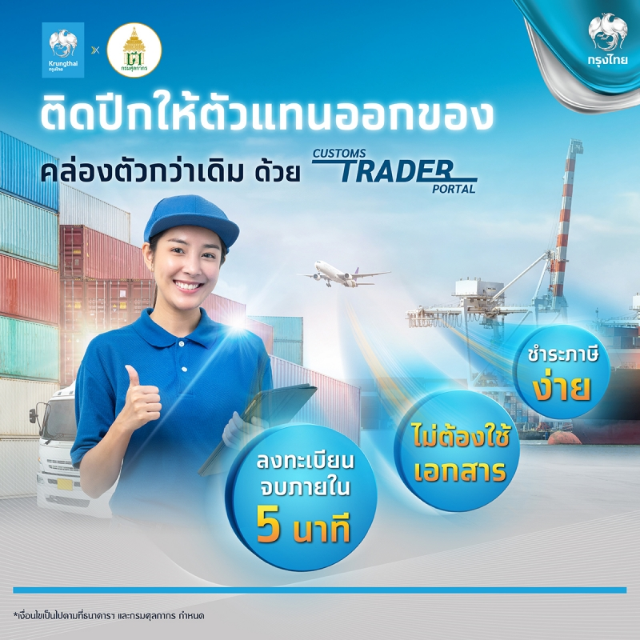

วันนี้ออกของคล่องตัวและประหยัดกว่าเดิม ตัวแทนออกของสามารถต่ออายุกับกรมศุลกากรง่ายๆผ่าน Customs Trader Portal

- สะดวก นิติบุคคลยืนยันตัวตนได้ผ่านแอปฯ เป๋าตัง
- คล่องตัว เชื่อมต่อข้อมูลกับกรมพัฒนาธุรกิจการค้าโดยตรง ไม่ต้องเตรียมเอกสาร
- ลดต้นทุน ประหยัดค่าใช้จ่ายในการเดินทาง ครบ จบ ผ่านช่องทางออนไลน์
- ชําระภาษีได้ทุกที่ ผ่านช่องทางอิเล็กทรอนิกส์ตามที่กรมศุลกากรกำหนด
 

ลงทะเบียนได้ที่เว็บไซต์ https://www.customstraderportal.com/register-juristic/

สอบถามข้อมูลได้ที่ สายด่วนบริการศุลกากร หมายเลขโทรศัพท์ 1164

> **วันที่ปรับปรุงล่าสุด :** 4 เมษายน 2566  
> **สอบถามข้อมูลเพิ่มเติมได้ที่ :** ฝ่ายประชาสัมพันธ์ สสก. สลข.  โทรศัพท์ : 0-2667-7600 อีเมล์ : prcustoms@gmail.com

> **ที่มา :** [กรมศุลกากร](https://www.customs.go.th/cont_strc_simple_with_date.php?current_id=14232932414a505f49464a4f464b4d)

