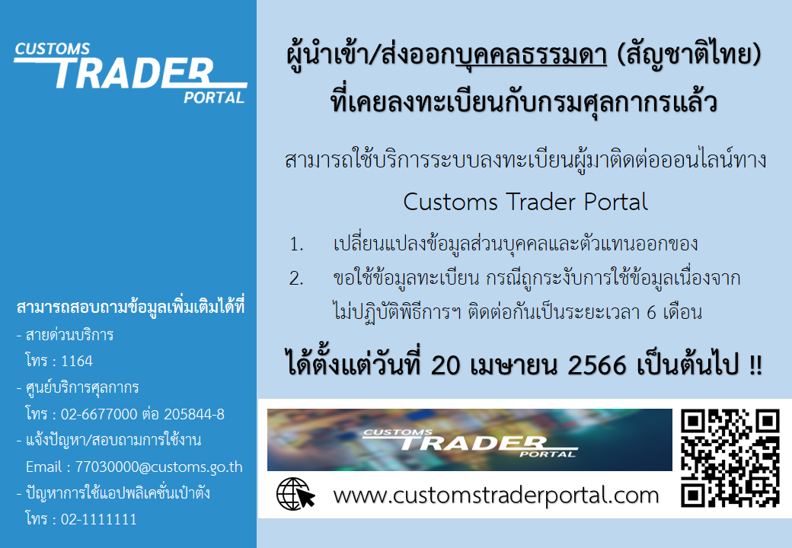

**การให้บริการระบบลงทะเบียนผู้มาติดต่อออนไลน์ทาง Customs trader Portal**

> **วันที่ปรับปรุงล่าสุด :** 25 เมษายน 2566   
> **สอบถามข้อมูลเพิ่มเติมได้ที่ :** ส่วนทะเบียนและสิทธิพิเศษ (สทพ.) กองมาตรฐานพิธีการและราคาศุลกากร (กมพ.)  
>   โทรศัพท์ : 02-6677000 ต่อ 20-4634 และ 20-4636

> **ที่มา :** [กรมศุลกากร](https://www.customs.go.th/cont_strc_simple_with_date.php?current_id=14232932414a505f4b464b4c464b47)

