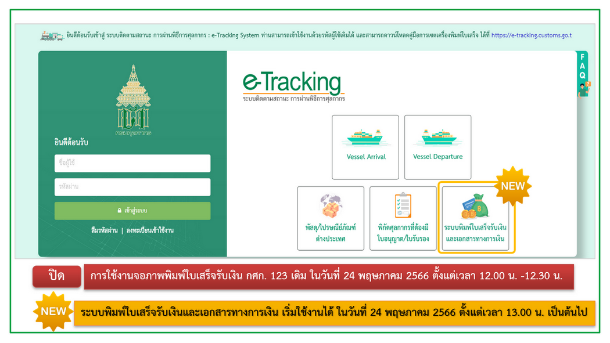

กรมศุลกากรแจ้งปิดการพิมพ์ใบเสร็จรับเงิน กศก.123 บนระบบ e-Tracking ใน*วันพุธที่ 24 พ.ค. 2566 ตั้งแต่เวลา 12:00 น. - 12:30 น.* โดยจะสามารถพิมพ์ใบเสร็จรับเงิน กศก. 123 ได้ที่ *"ระบบพิมพ์ใบเสร็จรับเงินและเอกสารการเงิน" ตั้งแต่เวลา 13:00 น. เป็นต้นไป*

> **ที่มา :** [กรมศุลกากร](https://www.customs.go.th/cont_strc_simple_with_date.php?current_id=14232932414b505e4f464b4a464b4c)

