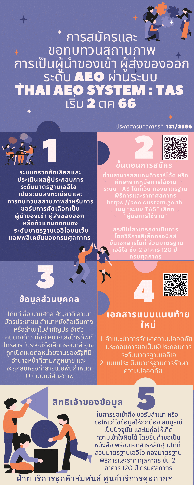

## การสมัครและขอทบทวนสถานภาพการเป็นผู้นำของเข้า ผู้ส่งของออกระดับมาตรฐานเออีโอ ผ่านระบบ THAI AEO SYSTEM : TAS

.      



**ที่มา :** [กรมศุลกากร](https://ccc.customs.go.th/cont_strc_faq.php?current_id=14232c32404e505e4e&left_menu=interesting_article)

**วันที่ปรับปรุงล่าสุด :** วันที่ 2 ตุลาคม 2566 
**สอบถามข้อมูลเพิ่มเติมได้ที่ :** ศูนย์บริการศุลกากร อาคารเฉลิมพระเกียรติ 7 รอบพระชนมพรรษา ชั้น 1
กรมศุลกากร  หมายเลขโทรศัพท์ : 1164 อีเมล์ : 1164@customs.go.th

