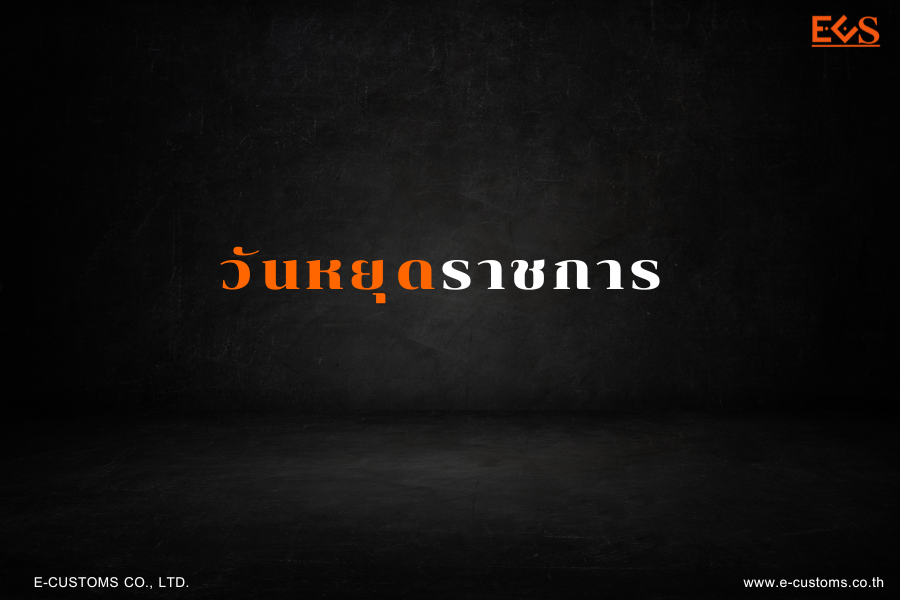



## ประกาศกรมศุลกากร เรื่อง วันหยุดราชการ

ด้วยคณะรัฐมนตรีได้มีมติเมื่อวันที่ 24 ตุลาคม 2566 เห็นชอบให้*เลื่อนวันหยุดชดเชยวันสิ้นปีประจำปี 2566* จากวันอังคารที่ 2 มกราคม 2567 **เป็น** วันศุกร์ที่ 29 ธันวาคม 2566 และกำหนดให้ วันจันทร์ที่ 30 ธันวาคม 2567 *เป็นวันหยุดราชการเพิ่มเป็นกรณีพิเศษ*ประจำปี 2567 และรับทราบภาพรวมวันหยุดราชการประจำปี 2567 จำนวน 20 วัน จึงขอประกาศให้ทราบทั่วกันว่า กรมศุลกากรจะปิดที่ทำการ ดังนี้  


| ลำดับ | วันที่ | รายละเอียด  |
|:----:|----------|----------|
|1. |วันศุกร์ที่ 29 ธันวาคม 2566| วันหยุดชดเชยวันสิ้นปีประจำปี 2566 |
|2. |วันจันทร์ที่ 26 กุมภาพันธ์ 2567| วันหยุดชดเชยวันมาฆบูชา|
|3. |วันจันทร์ที่ 8 เมษายน 2567 |วันหยุดชดเชยวันพระบาทสมเด็จพระพุทธยอดฟ้า จุฬาโลกมหาราชและวันที่ระลึกมหาจักรีบรมราชวงศ์|
|4.| วันอังคารที่ 16 เมษายน 2567| วันหยุดชดเชยวันสงกรานต์ |
|5.| วันจันทร์ที่ 6 พฤษภาคม 2567| วันหยุดชดเชยวันฉัตรมงคล |
|6. |วันจันทร์ที่ 22 กรกฎาคม 2567| วันหยุดชดเชยวันเข้าพรรษา |
|7. |วันจันทร์ที่ 29 กรกฎาคม 2567| วันหยุดชดเชยวันเฉลิมพระชนมพรรษา พระบาทสมเด็จพระปรเมนทรรามาธิบดี ศรีสินทรมหาวชิราลงกรณ พระวชิรเกล้าเจ้าอยู่หัว |
|8.| วันจันทร์ที่ 14 ตุลาคม 2567|วันหยุดชดเชยวันนวมินทรมหาราช |
|9. |วันจันทร์ที่ 30 ธันวาคม 2567| วันหยุดราชการเพิ่มเป็นกรณีพิเศษ|



ทั้งนี้ กรมศุลกากรจะเปิดทำการใน*วันอังคารที่ 2 มกราคม 2567* **จากเดิมที่กำหนดให้เป็นวันหยุดราชการ** ประกาศ ณ วันที่ 30 พฤศจิกายน พ.ศ. 2566





ดาวน์โหลดประกาศ

> ที่มา : [กรมศุลกากร](https://www.customs.go.th/data_files/754c98857c64e077017a6758985b4532.pdf)
