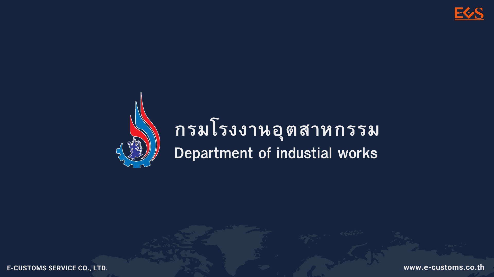

---
title:  กรมโรงงานอุตสาหกรรม ใช้งานรหัสยกเว้น EXEMPT100 วันที่ 13 -18 ส.ค. 2567
subtitle:  กรมโรงงานอุตสาหกรรม (DIW) เปิดใช้งานรหัสยกเว้น EXEMPT100 ตั้งแต่วันที่ 13 -18 สิงหาคม 2567
summary: กรมโรงงานอุตสาหกรรม (DIW) เปิดใช้งานรหัสยกเว้น EXEMPT100 ตั้งแต่วันที่ 13 -18 สิงหาคม 2567
authors: 
  - admin
tags: ["กรมโรงงานอุตสาหกรรม"]
categories: ["News"]
date: "2024-08-13"
publishDate: "2024-08-13"
lastMod: "2024-08-13"
featured: false
draft: false

image:
  placement:
  caption:
  focal_point: ""
  preview_only: true
---  

 ระบบเชื่อมโยงข้อมูลของกรมโรงงานอุตสาหกรรม (DIW) ขัดข้อง  ตั้งแต่วันอังคารที่ 13 สิงหาคม 2567 เวลาประมาณ 09:00 น. จึง *ไม่สามารถส่งข้อมูลไปยังกรมศุลกากรผ่านระบบ National Single Window (NSW) ได้*
 
 ทั้งนี้เพื่อเป็นการลดผลกระทบต่อผู้ประกอบการที่ต้องการนำเข้า - ส่งออกสินค้า ทางกรมโรงงานอุตสาหกรรม (DIW) จึงขอเปิดใช้งานรหัสยกเว้น *EXEMPT100* ตั้งแต่วันที่ 13/08/2567 ถึงวันที่ 18/08/2567 เวลา 00:00 น. โดยให้*ระบุ Issue Date* ตามวันที่แจ้ง วอ./อก.6 ในระบบรับแจ้งข้อเท็จจริงนำเข้าส่งออกวัตถุอันตราย (วอ./อก.6) ของกรมโรงงานอุตสาหกรรม (DIW)

> ที่มา : [ThaiNSW](https://www.thainsw.net)

