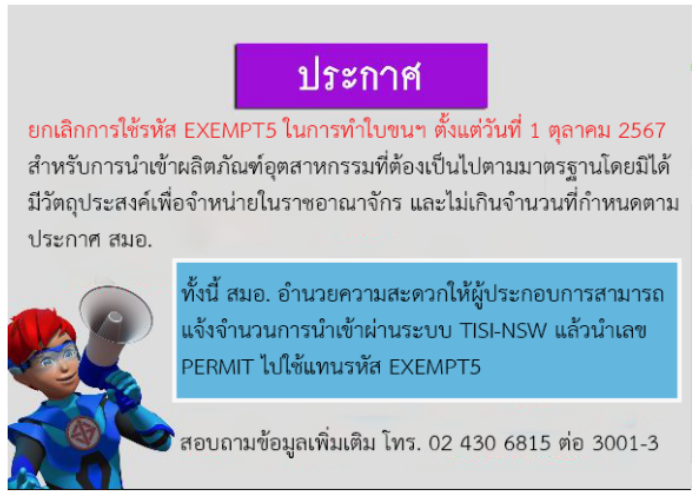
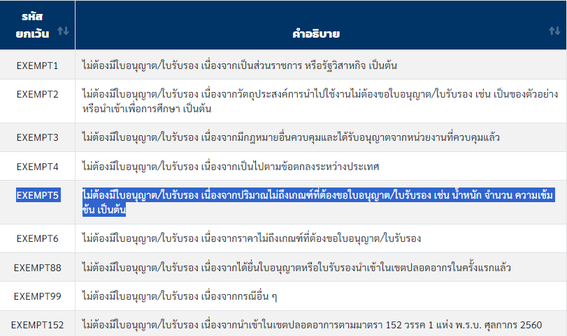

---
title:  สมอ. ประกาศยกเลิกการใช้รหัส EXEMPT5 ในการทำใบขนสินค้าขาเข้า
subtitle:  สำนักงานมาตรฐานอุตสาหกรรม ประกาศยกเลิกการใช้รหัส EXEMPT5 ในการทำใบขนสินค้าขาเข้า
summary: สำนักงานมาตรฐานอุตสาหกรรม ประกาศยกเลิกการใช้รหัส EXEMPT5 ในการทำใบขนสินค้าขาเข้า
authors: 
  - admin
tags: ["สมอ","EXEMPT5"]
categories: ["News"]
date: "2024-10-08"
publishDate: "2024-10-08"
lastMod: "2024-10-08"
featured: false
draft: false

image:
  placement:
  caption:
  focal_point: ""
  preview_only: true
---  

สำนักงานมาตรฐานอุตสาหกรรม หรือ สมอ. ประกาศยกเลิกการใช้รหัส EXEMPT5 ในการทำใบขนสินค้า (ขาเข้า) ตั้งแต่วันที่ 1 ตุลาคม 2567 เป็นต้นไป สำหรับการนำเข้าผลิตภัณฑ์อุตสาหกรรมโดยมิได้มีวัตถุประสงค์เพื่อการจำหน่ายในราชอาณจักร และไม่เกินจำนวนที่กำหนดตามประกาศ สมอ.

ทั้งนี้ สมอ. อำนวยความสะดวกให้ผู้ประกอบการสามารถแจ้งจำนวนการนำเข้าผ่านระบบ TISI-NSW แล้วนำเลขที่อนุญาต ไปใช้แทนรหัส EXEMPT5 โดยผู้นำเข้าสามารถตรวจสอบสินค้าที่ยกเลิกการใช้รหัส EXEMPT5 ได้จากประกาศ เรื่อง การกำหนดจำนวนการนำเข้า ผลิตภัณฑ์อุตสาหกรรม โดยมิได้มีวัตถุประสงค์เพื่อการจำหน่ายในราชอาณาจักร พ.ศ. 2566 

และสำนักงานมาตรฐานอุตสาหกรรมได้เปิด “ศูนย์เฉพาะกิจหารือแจ้งการนำเข้า” เพื่อให้คำปรึกษาแนะนำและอำนวยความสะดวกแก่ผู้ประกอบการและประชาชน ที่จะนำเข้าสินค้าควบคุม ทั้ง 144 รายการ เข้ามาในประเทศโดยมิได้มีวัตถุประสงค์เพื่อการจำหน่าย และไม่เกินจำนวนที่กำหนดตามประกาศของ สมอ. สามารถติดต่อศูนย์เฉพาะกิจฯ ได้ที่ชั้น 1 สมอ. หรือ โทร. 0 2430 6815 ต่อ 3001 – 3003 ได้ในวันและเวลาราชการ







ดาวน์โหลดประกาศ  

> ที่มา : [สำนักงานมาตรฐานอุตสาหกรรม](https://www.tisi.go.th/data/banner/pdf/EXEMPT99-25032564_01042564_1.pdf)

