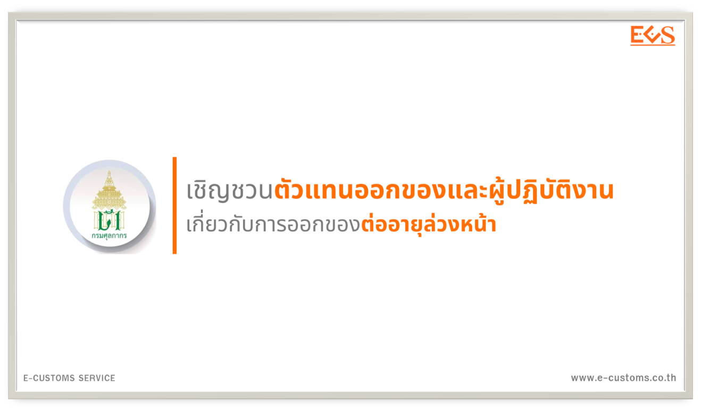

---
title:  เชิญชวนตัวแทนออกของและผู้ปฏิบัติงานเกี่ยวกับการออกของต่ออายุล่วงหน้า 
subtitle:  เนื่องจากมีตัวแทนออกของและผู้ปฏิบัติงานเกี่ยวกับการออกของ ที่จะหมดอายุตั้งแต่เดือนมกราคม พ.ศ. 2568 เป็นต้นไป พร้อม ๆ กัน เป็นจำนวนมาก จึงขอเชิญชวนให้ตัวแทนออกของและผู้ปฏิบัติงานเกี่ยวกับการออกของต่ออายุการอนุญาตล่วงหน้า (ต่ออายุล่วงหน้าได้ไม่เกิน 90 วัน ก่อนวันสิ้นสุดการอนุญาต) ก่อนวันครบกำหนดได้ตั้งแต่บัดนี้เป็นต้นไป
summary: เนื่องจากมีตัวแทนออกของและผู้ปฏิบัติงานเกี่ยวกับการออกของ ที่จะหมดอายุตั้งแต่เดือนมกราคม พ.ศ. 2568 เป็นต้นไป พร้อม ๆ กัน เป็นจำนวนมาก จึงขอเชิญชวนให้ตัวแทนออกของและผู้ปฏิบัติงานเกี่ยวกับการออกของต่ออายุการอนุญาตล่วงหน้า (ต่ออายุล่วงหน้าได้ไม่เกิน 90 วัน ก่อนวันสิ้นสุดการอนุญาต) ก่อนวันครบกำหนดได้ตั้งแต่บัดนี้เป็นต้นไป
authors: 
  - admin
tags: ["ตัวแทนออก"]
categories: ["News"]
date: "2024-11-06"
publishDate: "2024-11-06"
lastMod: "2024-11-06"
featured: false
draft: false

image:
  placement:
  caption:
  focal_point: ""
  preview_only: true
---  

เนื่องจากมีตัวแทนออกของและผู้ปฏิบัติงานเกี่ยวกับการออกของ ที่จะหมดอายุตั้งแต่เดือนมกราคม พ.ศ. 2568 เป็นต้นไป พร้อม ๆ กัน เป็นจำนวนมาก จึงขอเชิญชวนให้ตัวแทนออกของและผู้ปฏิบัติงานเกี่ยวกับการออกของต่ออายุการอนุญาตล่วงหน้า (ต่ออายุล่วงหน้าได้ไม่เกิน 90 วัน ก่อนวันสิ้นสุดการอนุญาต) ก่อนวันครบกำหนดได้ตั้งแต่บัดนี้เป็นต้นไป ผ่านช่องทาง ดังนี้

1. https://www.customstraderportal.com
2. https://registeronline.customs.go.th (เฉพาะตัวแทนออกของนิติบุคคล)
3. ส่วนทะเบียนและสิทธิพิเศษ กองมาตรฐานพิธีการและราคาศุลกากร ชั้น 1 อาคาร 120 ปี กรมศุลกากร
4. ฝ่ายบริหารงานทั่วไป หรือหน่วยงานที่ได้รับอนุมัติให้ลงทะเบียน ณ สำนักงาน/ด่านศุลกากร
ทั้งนี้ การต่ออายุการอนุญาตสามารถทำได้ล่วงหน้าไม่เกิน 90 วันก่อนวันสิ้นสุดการอนุญาต สอบถามเพิ่มเติมได้ที่ หมายเลขโทรศัพท์ 02-6677000 ต่อ 20-4636 และ 20-4639 หรือ Line official TH Customs Register ตาม QR Code 

ตรวจสอบรายชื่อตัวแทนออกของ ผู้ปฏิบัติงานเกี่ยวกับการออกของที่ลงทะเบียนกับกรมศุลกากรและวันหมดอายุ

- รายชื่อตัวแทนออกของที่จะหมดอายุในปี พ.ศ. 2568 (นิติบุคคล) ([ดาวน์โหลด](https://ecs-support.github.io/pages/company/files/2568/docs_01.pdf))
- รายชื่อตัวแทนออกของที่จะหมดอายุในปี พ.ศ. 2568 (บุคคลธรรมดา) ([ดาวน์โหลด](https://ecs-support.github.io/pages/company/files/2568/docs_02.pdf))
- รายชื่อผู้ปฏิบัติงานเกี่ยวกับการออกของที่จะหมดอายุในปี พ.ศ. 2568  (ชิปปิ้ง)  ([ดาวน์โหลด](https://ecs-support.github.io/pages/company/files/2568/docs_03.pdf))


**สอบถามข้อมูลเพิ่มเติมได้ที่ :** ส่วนทะเบียนและสิทธิพิเศษ (สทพ.) กองมาตรฐานพิธีการและราคาศุลกากร (กมพ.)  
**หมายเลขโทรศัพท์ :** 02-6677000 ต่อ 20-4634 และ 20-4636  
**วันที่ปรับปรุงล่าสุด :** 4 พฤศจิกายน 2567


