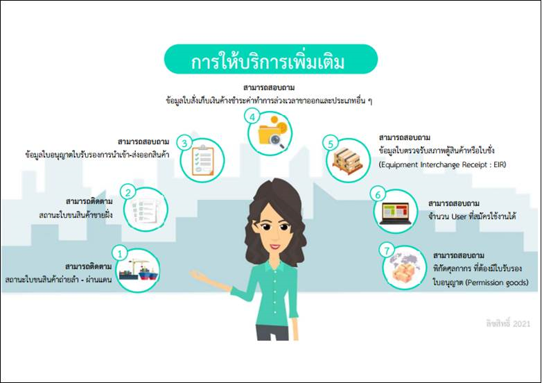

กรมศุลกากรเผยแพร่ **เอกสารประกอบการอบรมระบบติดตามสถานะการผ่านพิธีการศุลกากรทางอินเตอร์เน็ต (e-Tracking)** ที่จะจัดขึ้นในวันพุธที่ 15 กันยายน 2564 เวลา 09.30 - 12.00 น. ผ่านระบบออนไลน์ด้วยโปรแกรม Zoom Meeting  ซึ่งระบบใหม่เริ่มใช้งานใน*วันที่ 19 กันยายน 2564 เวลา 22:00 น. เป็นต้นไป*




 

 

<a class="badge badge-danger" href="./docs.pdf" target="_blank" id="download_files_new">Download</a>

 



> ที่มา : [กรมศุลกากร](https://drive.google.com/file/d/1EjQltknTBiDqcTuK3dxUrwCiVSlH-R8E/view)