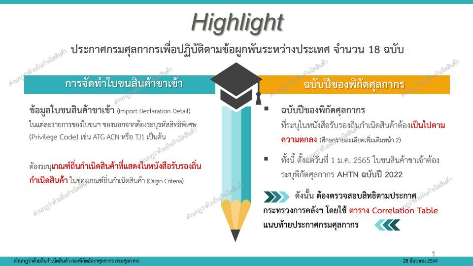
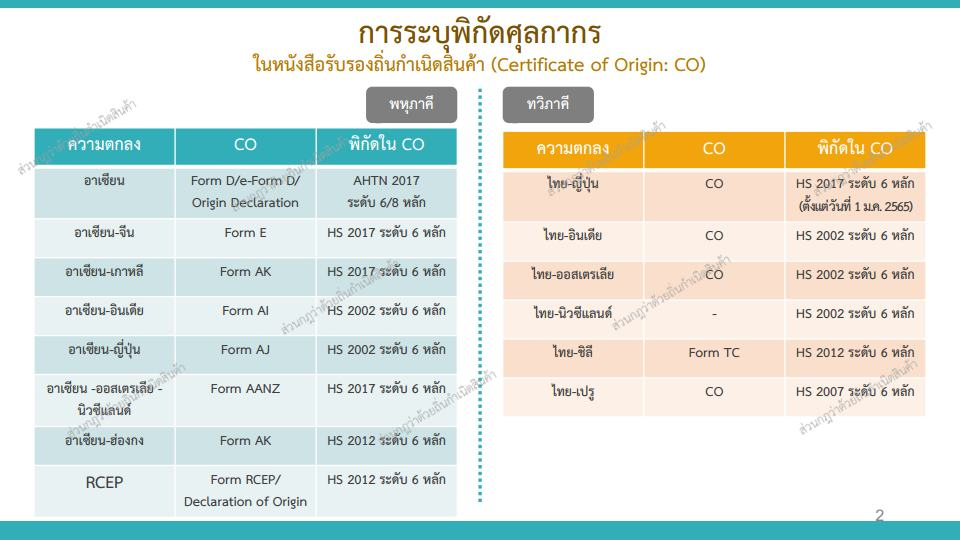
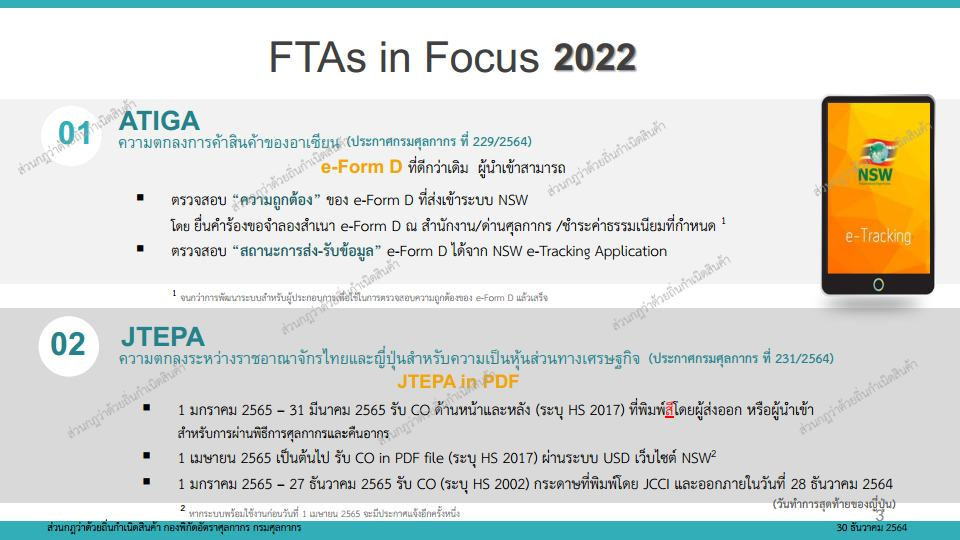
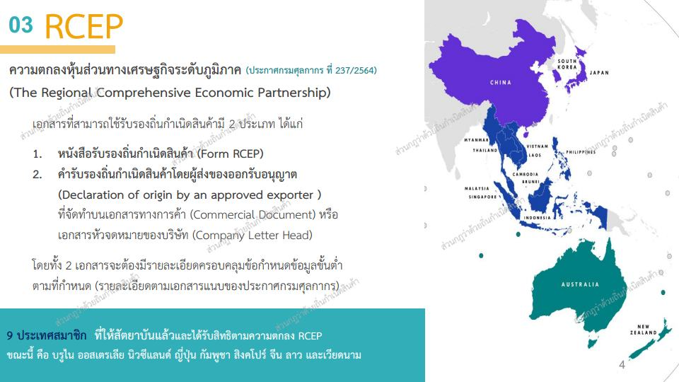

  
 
 


 

<a class="badge badge-danger" href="./docs.pdf" target="_blank" id="download_files_new">Download</a>

 



## ประกาศที่เกี่ยวข้อง

### ประกาศกระทรวงการคลัง

-   [การลดอัตราอากรศุลกากรสำหรับของที่มีถิ่นกำเนิด จากสาธารณรัฐประชาธิปไตยประชาชนลาว](https://www.customs.go.th/cont_strc_download_with_docno_date.php?lang=th&top_menu=menu_homepage&current_id=142329324146505f47464a4f464b46)
-   [การยกเว้นอากรและลดอัตราอากรศุลกากรสำหรับของที่มีถิ่นกำเนิดจากสาธารณรัฐเปรู](https://www.customs.go.th/cont_strc_download_with_docno_date.php?lang=th&top_menu=menu_homepage&current_id=142329324146505f47464b47464b46)
-   [การยกเว้นอากรและลดอัตราอากรศุลกากรสำหรับของที่มีถิ่นกำเนิดจากนิวซีแลนด์](https://www.customs.go.th/cont_strc_download_with_docno_date.php?lang=th&top_menu=menu_homepage&current_id=142329324146505f47464b47464a4f)
-   [การยกเว้นอากรศุลกากรสำหรับของที่มีถิ่นกำเนิดจากสาธารณรัฐสิงคโปร์](https://www.customs.go.th/cont_strc_download_with_docno_date.php?lang=th&top_menu=menu_homepage&current_id=142329324146505f47464b47464a4e)
-   [การยกเว้นอากร ลด และเพิ่มอัตราอากรศุลกากร สำหรับของที่มีถิ่นกำเนิดจากสาธารณรัฐประชาธิปไตยประชาชนลาว](https://www.customs.go.th/cont_strc_download_with_docno_date.php?lang=th&top_menu=menu_homepage&current_id=142329324146505f47464b46464b4d)
-   [การยกเว้นอากรและการลดอัตราอากรศุลกากรสำหรับของที่มีถิ่นกำเนิดจากสาธารณรัฐอินเดีย](https://www.customs.go.th/cont_strc_download_with_docno_date.php?lang=th&top_menu=menu_homepage&current_id=142329324146505f47464b46464b4c)
-   [การยกเว้นอากรศุลกากรสำหรับของที่มีถิ่นกำเนิดจากสาธารณรัฐประชาชนจีน](https://www.customs.go.th/cont_strc_download_with_docno_date.php?lang=th&top_menu=menu_homepage&current_id=142329324146505f47464b46464b4b)
-   [การยกเว้นอากรและลดอัตราอากรศุลกากรสำหรับของที่มีถิ่นกำเนิดจากสาธารณรัฐชิลี](https://www.customs.go.th/cont_strc_download_with_docno_date.php?lang=th&top_menu=menu_homepage&current_id=142329324146505f47464b46464b4a)
-   [การยกเว้นอากรและลดอัตราอากรศุลกากรสำหรับของที่มีถิ่นกำเนิดจากออสเตรเลีย](https://www.customs.go.th/cont_strc_download_with_docno_date.php?lang=th&top_menu=menu_homepage&current_id=142329324146505f47464b46464b49)
-   [การยกเว้นอากรและลดอัตราอากรศุลกากร ตามข้อผูกพันตามความตกลงหุ้นส่วนทางเศรษฐกิจระดับภูมิภาค](https://www.customs.go.th/cont_strc_download_with_docno_date.php?lang=th&top_menu=menu_homepage&current_id=142329324146505f47464b46464b47)
-   [การยกเว้นอากรศุลกากรสำหรับของที่มีถิ่นกำเนิดจากสาธารณรัฐแห่งสหภาพเมียนมา](https://www.customs.go.th/cont_strc_download_with_docno_date.php?lang=th&top_menu=menu_homepage&current_id=142329324146505f47464b46464a4e)
-   [การยกเว้นอากรและลดอัตราอากรศุลกากรสำหรับของที่มีถิ่นกำเนิดจากญี่ปุ่น](https://www.customs.go.th/cont_strc_download_with_docno_date.php?lang=th&top_menu=menu_homepage&current_id=142329324146505f47464a4f464b4d)
-   [การยกเว้นอากรสำหรับของที่นำเข้ามาในพื้นที่พัฒนาร่วม](https://www.customs.go.th/cont_strc_download_with_docno_date.php?lang=th&top_menu=menu_homepage&current_id=142329324146505f47464a4f464b4b)
-   [การลดอัตราอากรศุลกากรสำหรับการให้สิทธิพิเศษทางการค้าระหว่างประเทศกำลังพัฒนา](https://www.customs.go.th/cont_strc_download_with_docno_date.php?lang=th&top_menu=menu_homepage&current_id=142329324146505f47464a4f464b4a)
-   [การยกเว้นอากรสำหรับของที่มีถิ่นกำเนิดจากประเทศพัฒนาน้อยที่สุด](https://www.customs.go.th/cont_strc_download_with_docno_date.php?lang=th&top_menu=menu_homepage&current_id=142329324146505f47464a4f464b49)
-   [การยกเว้นอากรและลดอัตราอากรศุลกากรสำหรับของที่มีถิ่นกำเนิดจากอาเซียน](https://www.customs.go.th/cont_strc_download_with_docno_date.php?lang=th&top_menu=menu_homepage&current_id=142329324146505f47464a4f464b47)
-   [การยกเว้นอากรและลดอัตราอากรศุลกากรสำหรับเขตการค้าเสรีอาเซียน - สาธารณรัฐเกาหลี](https://www.customs.go.th/cont_strc_download_with_docno_date.php?lang=th&top_menu=menu_homepage&current_id=142329324146505f47464a4e464b4d)
-   [การยกเว้นอากรและลดอัตราอากรศุลกากรสำหรับเขตการค้าเสรีอาเซียน - ญี่ปุ่น](https://www.customs.go.th/cont_strc_download_with_docno_date.php?lang=th&top_menu=menu_homepage&current_id=142329324146505f47464a4e464b4c)
-   [การยกเว้นอากรและลดอัตราอากรศุลกากรสำหรับเขตการค้าเสรีอาเซียน - สาธารณรัฐอินเดีย](https://www.customs.go.th/cont_strc_download_with_docno_date.php?lang=th&top_menu=menu_homepage&current_id=142329324146505f47464a4e464b4b)
-   [การยกเว้นอากรและลดอัตราอากรศุลกากรสําหรับเขตการค้าเสรีอาเซียน - จีน](https://www.customs.go.th/cont_strc_download_with_docno_date.php?lang=th&top_menu=menu_homepage&current_id=142329324146505f47464a4e464b48)
-   [การยกเว้นอากรและลดอัตราอากรศุลกากรสำหรับเขตการค้าเสรีอาเซียน - ฮ่องกง](https://www.customs.go.th/cont_strc_download_with_docno_date.php?lang=th&top_menu=menu_homepage&current_id=142329324146505f47464a4e464b4a)
-   [การยกเว้นอากรและลดอัตราอากรศุลกากร สําหรับเขตการค้าเสรีอาเซียน - ออสเตรเลีย - นิวซีแลนด์](https://www.customs.go.th/cont_strc_download_with_docno_date.php?lang=th&top_menu=menu_homepage&current_id=142329324146505f47464a4e464b47)
-   [การยกเว้นอากร ลด และเพิ่มอัตราอากรศุลกากรตามข้อผูกพัน ในความตกลงมาร์ราเกชจัดตั้งองค์การการค้าโลก](https://www.customs.go.th/cont_strc_download_with_docno_date.php?lang=th&top_menu=menu_homepage&current_id=142329324146505f47464b47464b47)

### ประกาศกรมศุลกากร

-   [(215/.2564) หลักเกณฑ์และพิธีการการยกเว้นอากรและลดอัตราอากรศุลกากรสำหรับเขตการค้าเสรีอาเซียน-ออสเตรเลีย-นิวซีแลนด์](https://www.customs.go.th/cont_strc_download_with_docno_date.php?lang=th&top_menu=menu_homepage&current_id=142329324146505f46464b47464a4f)
-   [(216/.2564) หลักเกณฑ์และพิธีการการยกเว้นอากรและลดอัตราอากรศุลกากรสำหรับของที่มีถิ่นกำเนิดจากออสเตรเลีย](https://www.customs.go.th/cont_strc_download_with_docno_date.php?lang=th&top_menu=menu_homepage&current_id=142329324146505f46464b47464b46)
-   [(217/.2564) หลักเกณฑ์และพิธีการการยกเว้นอากรและลดอัตราอากรศุลกากรสำหรับของที่มีถิ่นกำเนิดจากนิวซีแลนด์](https://www.customs.go.th/cont_strc_download_with_docno_date.php?lang=th&top_menu=menu_homepage&current_id=142329324146505f46464b47464b47)
-   [(218/.2564) หลักเกณฑ์และพิธีการการยกเว้นอากรและลดอัตราอากรศุลกากรสำหรับเขตการค้าเสรีอาเซียน-จีน](https://www.customs.go.th/cont_strc_download_with_docno_date.php?lang=th&top_menu=menu_homepage&current_id=142329324146505f46464b47464b48)
-   [(219/.2564) หลักเกณฑ์และพิธีการการยกเว้นอากรศุลกากรสำหรับของที่มีถิ่นกำเนิดจากสาธารณรัฐประชาชนจีน](https://www.customs.go.th/cont_strc_download_with_docno_date.php?lang=th&top_menu=menu_homepage&current_id=142329324146505f46464b47464b49)
-   [(220/.2564) หลักเกณฑ์และพิธีการการยกเว้นอากรศุลกากรสำหรับของที่มีถิ่นกำเนิดจากสาธารณรัฐสิงคโปร์](https://www.customs.go.th/cont_strc_download_with_docno_date.php?lang=th&top_menu=menu_homepage&current_id=142329324146505f46464b49464a4e)
-   [(226/.2564) หลักเกณฑ์และพิธีการการยกเว้นอากรและลดอัตราอากรศุลกากรสำหรับของที่มีถิ่นกำเนิดจากสาธารณรัฐเปรู](https://www.customs.go.th/cont_strc_download_with_docno_date.php?lang=th&top_menu=menu_homepage&current_id=142329324146505f46464b47464b4a)
-   [(227/.2564) หลักเกณฑ์และพิธีการการยกเว้นอากรและลดอัตราศุลกากรสำหรับของที่มีถิ่นกำเนิดจากสาธารณรัฐชิลี](https://www.customs.go.th/cont_strc_download_with_docno_date.php?lang=th&top_menu=menu_homepage&current_id=142329324146505f46464b48464b48)
-   [(228/.2564) หลักเกณฑ์และพิธีการการยกเว้นอากรและลดอัตราศุลกากรสำหรับเขตการค้าเสรีอาเซียน-สาธารณรัฐอินเดีย](https://www.customs.go.th/cont_strc_download_with_docno_date.php?lang=th&top_menu=menu_homepage&current_id=142329324146505f46464b48464b47)
-   [(229/.2564) หลักเกณฑ์และพิธีการการยกเว้นอากรและลดอัตราอากรศุลกากรสำหรับของที่มีถิ่นกำเนิดจากอาเซียน](https://www.customs.go.th/cont_strc_download_with_docno_date.php?lang=th&top_menu=menu_homepage&current_id=142329324146505f46464b48464b46)
-   [(230/.2564) หลักเกณฑ์และพิธีการการยกเว้นอากรและลดอัตราศุลกากรสำหรับเขตการค้าเสรีอาเซียน-ญี่ปุ่น](https://www.customs.go.th/cont_strc_download_with_docno_date.php?lang=th&top_menu=menu_homepage&current_id=142329324146505f46464b48464b4c)
-   [(231/.2564) หลักเกณฑ์และพิธีการการยกเว้นอากรและลดอัตราอากรศุลกากรสำหรับของที่มีถิ่นกำเนิดจากญี่ปุ่น](https://www.customs.go.th/cont_strc_download_with_docno_date.php?lang=th&top_menu=menu_homepage&current_id=142329324146505f46464b48464a4f)
-   [(232/.2564) หลักเกณฑ์และพิธีการการยกเว้นอากรและลดอัตราอากรศุลกากรสำหรับของที่มีถิ่นกำเนิดจากสาธารณรัฐอินเดีย](https://www.customs.go.th/cont_strc_download_with_docno_date.php?lang=th&top_menu=menu_homepage&current_id=142329324146505f46464b48464a4e)
-   [(233/.2564) หลักเกณฑ์และพิธีการการยกเว้นอากรและลดอัตราศุลกากรสำหรับเขตการค้าเสรีอาเซียน-ฮ่องกง](https://www.customs.go.th/cont_strc_download_with_docno_date.php?lang=th&top_menu=menu_homepage&current_id=142329324146505f46464b47464b4d)
-   [(234/.2564) หลักเกณฑ์และพิธีการการยกเว้นอากรและลดอัตราศุลกากรสำหรับเขตการค้าเสรีอาเซียน-สาธารณรัฐเกาหลี](https://www.customs.go.th/cont_strc_download_with_docno_date.php?lang=th&top_menu=menu_homepage&current_id=142329324146505f46464b47464b4c)
-   [(235/.2564) หลักเกณฑ์และพิธีการการลดอัตราอากรศุลกากรสำหรับการให้สิทธิพิเศษทางการค้าระหว่างประเทศกำลังพัฒนา](https://www.customs.go.th/cont_strc_download_with_docno_date.php?lang=th&top_menu=menu_homepage&current_id=142329324146505f46464b48464b49)
-   [(236/.2564) หลักเกณฑ์และพิธีการการยกเว้นอากรสำหรับของที่มีถิ่นกำเนิดจากประเทศพัฒนาน้อยที่สุด](https://www.customs.go.th/cont_strc_download_with_docno_date.php?lang=th&top_menu=menu_homepage&current_id=142329324146505f46464b48464b4a)
-   [(237/.2564) หลักเกณฑ์และพิธีการการยกเว้นอากรและอัตราอากรศุลกากรตามข้อผูกพันตามความตกลงหุ้นส่วนทางเศรษฐกิจระดับภูมิภาค](https://www.customs.go.th/cont_strc_download_with_docno_date.php?lang=th&top_menu=menu_homepage&current_id=142329324146505f46464b4b464b4c)
-   [(238/.2564) หลักเกณฑ์และพิธีการการยกเว้นอากร ลดและเพิ่มอัตราอากรศุลกากรตามข้อผูกพันในความตกลงมาร์ราเกชจัดตั้งองค์การการค้าโลก](https://www.customs.go.th/cont_strc_download_with_docno_date.php?lang=th&top_menu=menu_homepage&current_id=142329324146505f46464b4d464b48)
-   [(239/.2564) หลักเกณฑ์และพิธีการการยกเว้นอากร ลดและเพิ่มอัตราอากรศุลกากรสำหรับของที่มีถิ่นกำเนิดจากสาธารณรัฐประชาธิปไตยประชาชนลาว](https://www.customs.go.th/cont_strc_download_with_docno_date.php?lang=th&top_menu=menu_homepage&current_id=142329324146505f46464b4d464b49)
-   [(243/.2564) หลักเกณฑ์และพิธีการการยกเว้นอากรศุลกากรสำหรับของที่มีถิ่นกำเนิดจากสาธารณรัฐแห่งสหภาพเมียนมา](https://www.customs.go.th/cont_strc_download_with_docno_date.php?lang=th&top_menu=menu_homepage&current_id=142329324146505f46464b4d464b4d)
- [(244/.2564) หลักเกณฑ์และพิธีการการลดอัตราอากรศุลกากรสำหรับของที่มีถิ่นกำเนิดจากสาธารณประชาธิปไตยประชาชนลาว](https://www.customs.go.th/cont_strc_download_with_docno_date.php?lang=th&top_menu=menu_homepage&current_id=142329324146505f46464b4d464b4b)

> ที่มา : [กรมศุลกากร](https://www.customs.go.th/cont_strc_simple_with_date.php?current_id=142329324146505f46464b46464b4b)