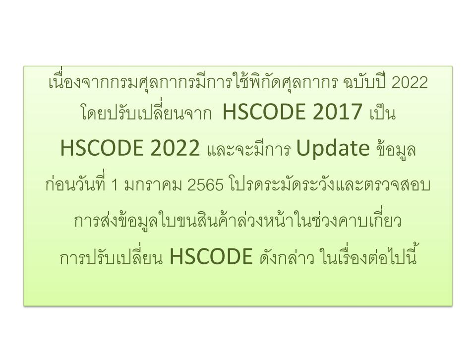
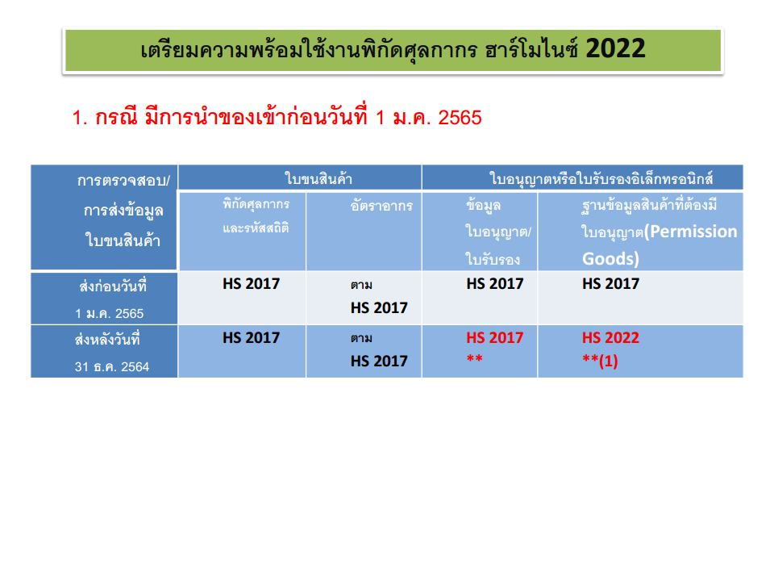
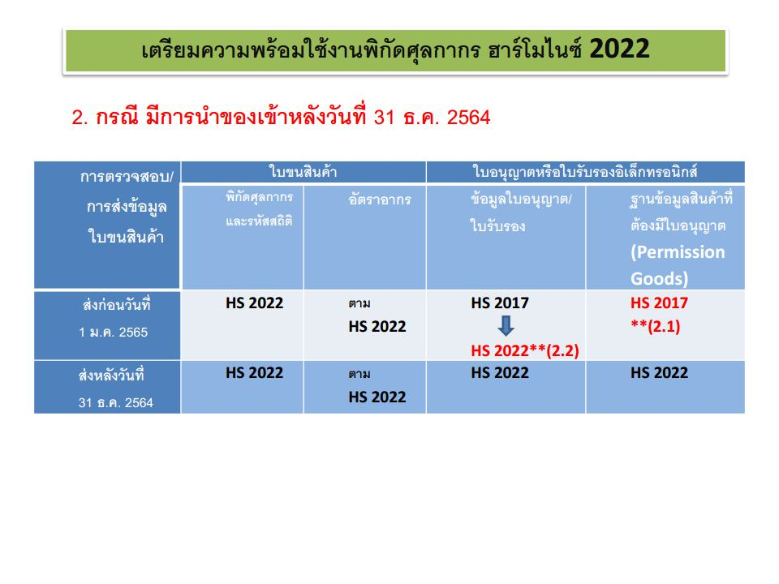
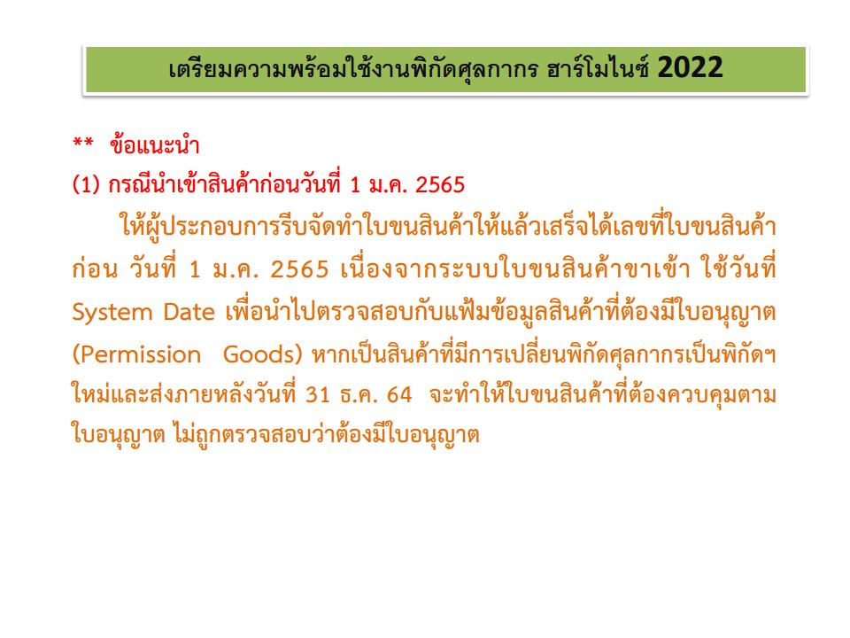
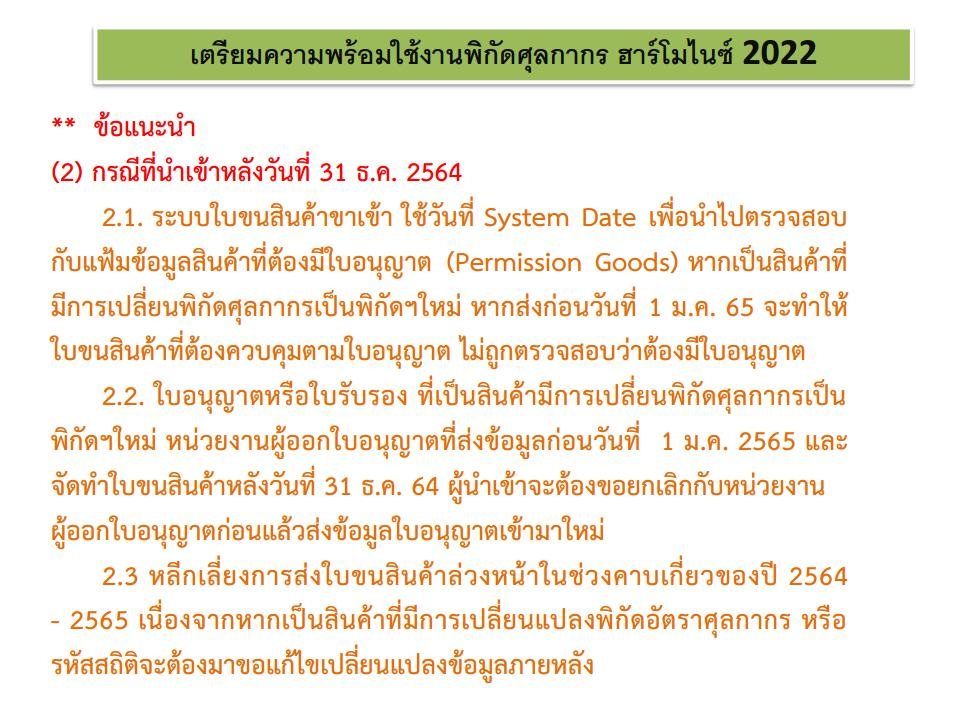

  
 
 
 


 

<a class="badge badge-danger" href="./docs.pdf" target="_blank" id="download_files_new">Download</a>

 



> ที่มา : [กรมศุลกากร](https://www.customs.go.th/data_files/a1433d64923dd1ade50c715fda5aee00.pdf)