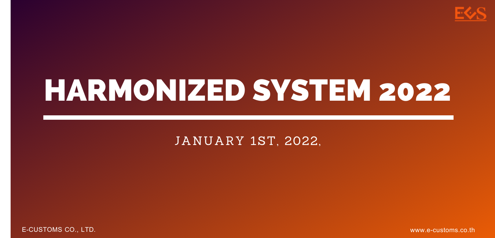

เอกสารประกอบการสัมมนาโครงการฝึกอบรมหลักสูตรพิกัดศุลกากรระบบฮาร์โมไนซ์และพิกัดศุลกากรฮาร์โมไนซ์อาเซียน ฉบับปี 2022 สำหรับผู้ประกอบการและบุคคลทั่วไป  




 

<a class="badge badge-danger" href="./docs.pdf" target="_blank" id="download_files_new">Download</a>

 



> ที่มา : [กรมศุลกากร](https://www.customs.go.th/data_files/a1a13d94c2b5ddcb836bc93b9df8a115.pdf)
