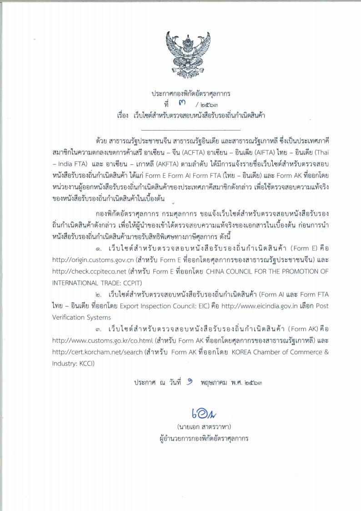

---
# Course title, summary, and position.
linktitle: ภาพรวม
summary: Free Trade Area หรือเขตการค้าเสรี เป็นการทำความตกลงทางการค้าของประเทศ อาจเป็น 2 ประเทศ (ทวิภาคี) หรือเป็นกลุ่มประเทศ (พหุภาคี) ที่จะร่วมมือขจัดอุปสรรคทางการค้าทั้งที่เป็นภาษีศุลกากรและไม่ใช่ภาษีศุลกากร

# Page metadata.
title: เขตการค้าเสรี (Free Trade Area)
date: "2020-05-12T00:00:00Z"
lastmod: "2020-05-12T00:00:00Z"
draft: false  # Is this a draft? true/false

# Optional header image (relative to `static/img/` folder).
menu:
  free-trade:
    parent: สิทธิพิเศษทางการค้า
    weight: 1    
weight: 1
---

Free Trade Area หรือเขตการค้าเสรี เป็นการทำความตกลงทางการค้าของประเทศ อาจเป็น 2 ประเทศ (ทวิภาคี) หรือเป็นกลุ่มประเทศ (พหุภาคี) ที่จะร่วมมือขจัดอุปสรรคทางการค้าทั้งที่เป็นภาษีศุลกากรและไม่ใช่ภาษีศุลกากร

## ความเป็นมาของเขตการค้าเสรี
แนวคิดของการมีนโยบายการค้าเสรี คือประเทศจะเลือกผลิตสินค้าที่ตนเองถนัด และมีต้นทุนการผลิตต่ำที่สุด คือจะผลิตสินค้าที่คิดว่าประเทศตนได้เปรียบเชิงเปรียบเทียบ (Comparative Advantage)มากที่สุด แล้วนำสินค้าที่ผลิตได้นี้ไปแลกเปลี่ยนกับสินค้าที่ประเทศตนไม่ถนัด หรือเสียเปรียบ โดยแลกเปลี่ยนสินค้ากับประเทศอื่นที่ผลิตสินค้าแล้วได้เปรียบ ดังนั้นประเทศทั้งสองก็จะทำการค้าต่อกันได้ โดยต่างฝ่ายต่างสมประโยชน์กัน (Win-Win Situation)  

## นโยบายการค้าเสรีมีดังนี้

1.  การผลิตตามหลักการแบ่งงานกันทำเลือกผลิตสินค้าที่มีต้นทุนการผลิตต่ำและประเทศมีศักยภาพในการผลิตสินค้านั้นสูง
2.  ไม่เก็บภาษีคุ้มกัน (Protective Duty) เพื่อคุ้มครองหรือปกป้องอุตสาหกรรมภายในประเทศ
3.  ไม่ให้สิทธิพิเศษหรือกีดกันสินค้าของประเทศใดประเทศหนึ่ง
4.  เรียกเก็บภาษีในอัตราเดียวและให้ความเป็นธรรมแก่สินค้าของทุกประเทศเท่ากัน ไม่มีข้อจำกัดทางการค้า (Trade Restriction) ที่เป็นอุปสรรคต่อการค้าระหว่างประเทศไม่มีการควบคุมการนำเข้า หรือการส่งออกที่เป็นอุปสรรคต่อการค้าระหว่างประเทศ ยกเว้นการควบคุมสินค้าบางอย่างที่เกี่ยวกับสุขภาพอนามัยและเป็นอันตรายต่อมนุษย์และสินค้าที่เกี่ยวด้วยศีลธรรมจรรยาหรือความมั่นคงของประเทศ

  
## ความหมายของเขตการค้าเสรี
เขตการค้าเสรี หมายถึง การวมกลุ่มเศรษฐกิจโดยมีเป้าหมายเพื่อลดภาษีศุลกากรระหว่างกันภายในกลุ่ม ที่ทำข้อตกลงให้เหลือน้อยที่สุดหรือเป็น 0% และใช้อัตราภาษีปกติที่สูงกว่ากับประเทศนอกกลุ่ม การทำเขตการค้าเสรีในอดีตมุ่งในด้านการเปิดเสรีด้านสินค้า โดยการลดภาษีและอุปสรรคที่ไม่ใช่ภาษีเป็นหลักแต่เขตการค้าเสรีในระยะหลัง ๆ นั้น รวมไปถึงการเปิดเสรีด้านอื่น ๆ ด้วย เช่น ด้านการบริการการลงทุน เป็นต้น  
  
## เขตการค้าเสรีที่สำคัญของไทย
เขตการค้าเสรีที่มีมูลค่าสูงในทางการค้า ได้แก่ เขตการค้าเสรีอาเซียน (AFTA) เขตการค้าเสรีอาเซียน-จีน ไทย-ญี่ปุ่น อาเซียน-เกาหลี เป็นต้น

## ประกาศล่าสุดที่เกี่ยวข้อง

{}

### เว็บไซต์สำหรับตรวจสอบหนังสือรับรองถิ่นกำเนิดสินค้า

ประกาศกองพิกัดอ้ตราศุลกากร ที่ 3/ 2563 เรื่อง **เว็บไซต์สำหรับตรวจสอบหนังสือรับรองถิ่นกำเนิดสินค้า**

{}

### การแสดงหนังสือรับรองถิ่นกำเนิดสินค้า 

{}
การแสดงหนังสือรับรองถิ่นกำเนิดสินค้า สำหรับผู้นำของเข้าที่ได้รับผลกระทบจากการแพร่ระบาดของโรคติดเชื้อไวรัสโคโรนา 2019 ให้ผู้นำเข้าสามารถแสดงสำเนาภาพถ่ายหนังสือรับรองถิ่นกำเนิดสินค้าเพื่อใช้ในการปฏิบัติพิธีการศุลกากรได้ โดยให้เพิ่มการระบุข้อความในช่อง Remark (หมายเหตุส่งกรมฯ) *"ขอใช้สำเนาภาพถ่ายหนังสือรับรองถิ่นกำเนิดสินค้าไปพลางก่อนและจะแสดงต้นฉบับหนังสือรับรองถิ่นกำเนิดสินค้าในภายหลัง"*

ตามประกาศกรมศุลกากรที่ 81/ 2563 เรื่อง การแสดงหนังสือรับรองถิ่นกำเนิดสินค้า สำหรับผู้นำของเข้าที่ได้รับผลกระทบจากการแพร่ระบาดของโรคติดเชื้อไวรัสโคโรนา 2019 (โควิด-19) ตั้งแต่บัดนี้เป็นต้นไป จนถึงวันที่ 30 กันยายน 2563 [[*ดาวน์โหลด*]](http://www.customs.go.th/cont_strc_download_with_docno_date.php?lang=th&top_menu=menu_homepage&current_id=14232832414a505f4a464b47464a4f)  
{}

{}
- **สอบถามข้อมูลเพิ่มเติมได้ที่ :** ส่วนกฎว่าด้วยถิ่นกำเนิดสินค้า (สกก.) กองพิกัดอัตราศุลกากร (กพก.) 
กรมศุลกากร เลขที่ 1 ถ.สุนทรโกษา คลองเตย กทม. 10110  
- **หมายเลขโทรศัพท์ :** 0-2667-7014 หรือ 0-2667-6459  
- **อีเมล์ :** 80150000@customs.go.th
{}
